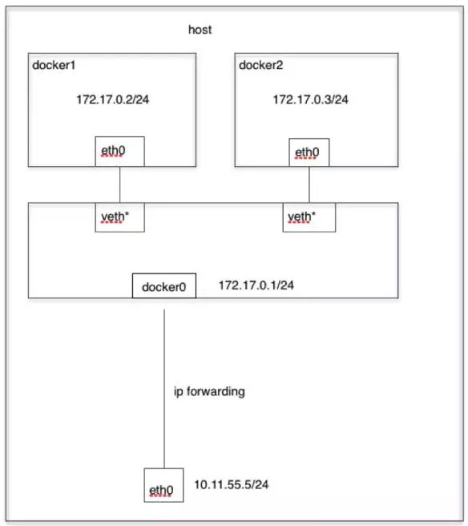
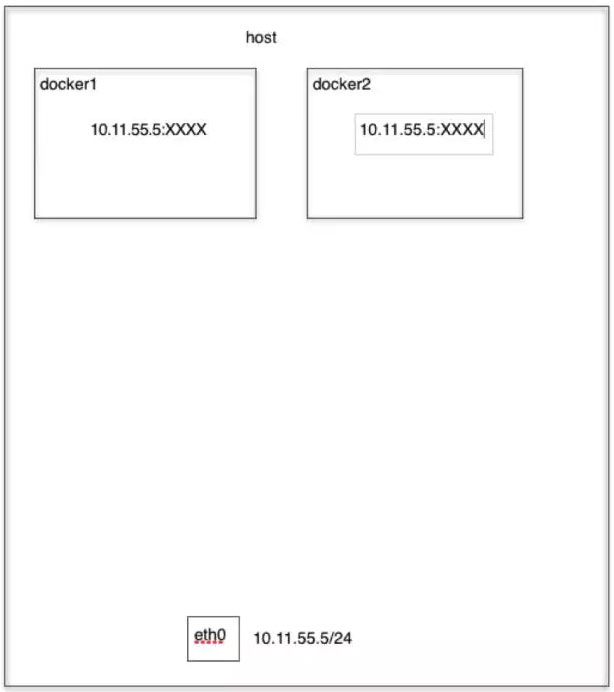
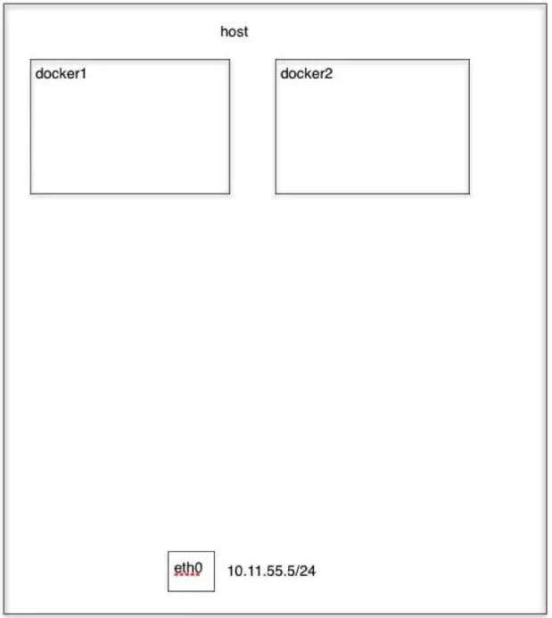

## 基本操作

> 镜像和容器的常用操作

> Docker 的基本原理我们已经了解了，也已经安装上了，接下来我们就一起来学习下 Docker 的常用操作，实际上主要就是 Docker CLI 的一些常用命令使用。

> 

### 镜像操作 

> 之前我们提到过 Docker 官方提供了一个公共的镜像仓库：Docker Hub，我们就可以从这上面获取镜像，获取镜像的命令：`docker pull`，格式为：

```
$ docker pull [选项] [Docker Registry 地址[:端口]/]仓库名[:标签]
```

*   Docker 镜像仓库地址：地址的格式一般是 `<域名/IP>[:端口号]`，默认地址是 Docker Hub 官方地址。
*   仓库名：这里的仓库名是两段式名称，即 `<用户名>/<软件名>`。对于 Docker Hub，如果不给出用户名，则默认为 library，也就是官方镜像。比如：

```
$ docker pull ubuntu:04
04: Pulling from library/ubuntu
7ddbc47eeb70: Pull complete
c1bbdc448b72: Pull complete
8c3b70e39044: Pull complete
45d437916d57: Pull complete
Digest: sha256:6e9f67fa63b0323e9a1e587fd71c561ba48a034504fb804fd26fd8800039835d
Status: Downloaded newer image for ubuntu:04
```

> 上面的命令中没有给出 Docker 镜像仓库地址，因此将会从 Docker Hub 获取镜像。而镜像名称是 ubuntu:18.04，因此将会获取官方镜像 `library/ubuntu` 仓库中标签为 18.04 的镜像。从下载过程中可以看到我们之前提及的分层存储的概念，镜像是由多层存储所构成。下载也是一层层的去下载，并非单一文件。下载过程中给出了每一层的 ID 的前 12 位。并且下载结束后，给出该镜像完整的sha256 的摘要，以确保下载一致性。

> 然后可以使用如下命令查看系统中已有的镜像：

```
$ docker images
REPOSITORY          TAG                 IMAGE ID            CREATED             SIZE
ubuntu              04               775349758637        19 hours ago        2MB
busybox             latest              020584afccce        42 hours ago        22MB
hello-world         latest              fce289e99eb9        10 months ago       84kB
```

> 列表包含了仓库名、标签、镜像 ID、创建时间以及所占用的空间。镜像 ID 则是镜像的唯一标识，一个镜像可以对应多个标签。

> 如果某个镜像不需要了，可以使用如下面命令删除镜像：

```
# 根据镜像名或者镜像ID删除都可以
$ docker rmi -f hello-world
Untagged: hello-world:latest
Untagged: hello-world@sha256:c3b4ada4687bbaa170745b3e4dd8ac3f194ca95b2d0518b417fb47e5879d9b5f
Deleted: sha256:fce289e99eb9bca977dae136fbe2a82b6b7d4c372474c9235adc1741675f587e
```

> 还可以给镜像重新打上一个 tag：

```
$ docker tag nginx nginx:test
```

> 另外我们还可以将镜像导出成一个独立的文件：

```
$ docker save nginx >/tmp/nginx.tar.gz
$ ls -la /tmp/nginx.tar.gz
-rw-r--r--. 1 root root 130066944 Nov  2 02:58 /tmp/nginx.tar.gz
```

> 对于无法访问外网的请情况下会经常使用这种方法导出镜像，然后使用 load 命令导入镜像：

```
$ docker load </tmp/nginx.tar.gz
```

### 运行容器 

> 有了镜像后，我们就能够以这个镜像为基础运行一个容器。以上面的 ubuntu:18.04 为例，如果我们打算启动里面的 bash 并且进行交互式操作的话，可以执行下面的命令：

```
$ docker run -it --rm \\
    ubuntu:04 \\
    /bin/bash

root@ec125fc290ca:/# cat /etc/os-release
NAME="Ubuntu"
VERSION="3 LTS (Bionic Beaver)"
ID=ubuntu
ID_LIKE=debian
PRETTY_NAME="Ubuntu 3 LTS"
VERSION_ID="04"
HOME_URL="https://www.ubuntu.com/"
SUPPORT_URL="https://help.ubuntu.com/"
BUG_REPORT_URL="https://bugs.launchpad.net/ubuntu/"
PRIVACY_POLICY_URL="https://www.ubuntu.com/legal/terms-and-policies/privacy-policy"
VERSION_CODENAME=bionic
UBUNTU_CODENAME=bionic
```

> `docker run`就是运行容器的命令，我们这里简要的说明一下上面用到的参数:

*   -it：这是两个参数，一个是 `-i` 交互式操作，一个是 `-t` 终端。我们这里打算进入 bash 执行一些命令并查看返回结果，因此我们需要交互式终端。
*   --rm：这个参数是说容器退出后随之将其删除。默认情况下，退出的容器并不会立即删除，除非手动 docker rm。我们这里只是执行个命令，看看结果，不需要保留结果，因此使用`--rm`可以避免浪费空间。
*   ubuntu:18.04：这是指用 ubuntu:18.04 镜像为基础来启动容器。
*   bash：放在镜像名后的是命令，这里我们希望有个交互式 Shell，因此用的是 bash。

> 进入容器后，我们可以在 Shell 下操作，执行任何所需的命令。这里，我们执行了`cat /etc/os-release`，这是 Linux 常用的查看当前系统版本的命令，从返回的结果可以看到容器内是 Ubuntu 16.04.4 LTS 系统。最后我们通过 exit 退出了这个容器。

> 当利用`docker run`来创建容器时，Docker 在后台运行的流程如下所示：

*   检查本地是否存在指定的镜像，不存在就从公有仓库下载
*   利用镜像创建并启动一个容器
*   分配一个文件系统，并在只读的镜像层外面挂载一层可读写层
*   从宿主主机配置的网桥接口中桥接一个虚拟接口到容器中去
*   从地址池配置一个 ip 地址给容器
*   执行用户指定的应用程序
*   执行完毕后容器被终止

> 另外需要注意的是容器管理的核心是容器执行的应用程序这个进程，所以如果这个进程不是常驻前台的话则执行后容器就会退出了，比如上面我们是执行的 `/bin/bash` 这个程序，这个程序会常驻前台，所以容器会一直存在，而且这个这个程序在容器中的进程ID=1：

```
root@6bc39e8cd11c:/# ps
  PID TTY          TIME CMD
    1 pts/0    00:00:00 bash
   11 pts/0    00:00:00 ps
```

> 但是如果我们运行一个普通的命令呢：

```
$ docker run -it ubuntu:04 ls
bin   dev  home  lib64  mnt  proc  run   srv  tmp  var
boot  etc  lib   media  opt  root  sbin  sys  usr
```

> 我们可以看到运行后就容器就直接退出了，这点非常重要，所以如果要在容器中执行 nginx 程序的话要记住不要用 daemon 模式了，因为执行后就退出到后台去了，Docker 就没办法管理了，就会退出容器了。

### 列出容器 

> 如果要查看当前系统中已经运行的容器，可以用如下命令：

`$ docker ps`

> 如果把已经退出的容器也列出来可以加上 `-a` 参数：

```
$ docker ps -a
CONTAINER ID        IMAGE               COMMAND             CREATED             STATUS                         PORTS               NAMES
2275424275b6        ubuntu:04        "ls"                3 minutes ago       Exited (0) 3 minutes ago                           ecstatic_gates
6e4a54862340        fce289e99eb9        "/hello"            About an hour ago   Exited (0) About an hour ago                       jovial_khayyam
```

### 删除容器 

> 如果要删除或强制删除一个容器（包括已退出的）则可以使用如下命令：

```
# 根据容器ID强制删除容器
$ docker rm -f 2275424275b6
```

### 后台运行 

> 更多的时候，我们需要让 Docker 在后台运行而不是直接把执行命令的结果输出在当前宿主机下。此时，可以通过添加`-d`参数来实现。如果不使用`-d`参数运行容器：

```
$ docker run ubuntu:04 /bin/sh -c "while true; do echo hello world; sleep 1; done"
hello world
hello world
hello world
hello world
```

> 容器会把输出的结果 (STDOUT) 打印到宿主机上面。如果使用了`-d`参数运行容器：

```
$ docker run -d ubuntu:04 /bin/sh -c "while true; do echo hello world; sleep 1; done"
501f4d9538a0b01f0ac422089258ad71fa88c016f2662c1120c1499b5fbc930f
```

> 此时容器会在后台运行并不会把输出的结果 (STDOUT) 打印到宿主机上面(输出结果可以用 docker logs 查看)：

```
# docker logs -f [container ID or NAMES]
$ docker logs -f 501f4d9538a0b01f0ac422089258ad71fa88c016f2662c1120c1499b5fbc930f
hello world
hello world
hello world
```

> > 注：容器是否会长久运行，是和 docker run 指定的命令有关，和 -d 参数无关。

> 使用 `-d` 参数启动后会返回一个唯一的容器 id，当然也可以通过`docker ps`命令来查看容器信息。

### 终止容器 

> 另外我们可以使用

```
docker stop [container ID or NAMES]
```

来终止一个运行中的容器。此外，当 Docker 容器中指定的应用终结时，容器也自动终止。例如前面只启动了一个终端的容器，用户通过 exit 命令或 Ctrl+d 来退出终端时，所创建的容器立刻终止。终止状态的容器可以用`docker ps -a` 命令看到：

```
$ docker ps
CONTAINER ID        IMAGE               COMMAND                  CREATED              STATUS              PORTS               NAMES
501f4d9538a0        ubuntu:04        "/bin/sh -c 'while t…"   About a minute ago   Up About a minute                       nervous_ganguly
$ docker stop 501f4d9538a0
501f4d9538a0
$ docker ps
CONTAINER ID        IMAGE               COMMAND             CREATED             STATUS              PORTS               NAMES
```

> 同样可以用

```
docker start [container ID or NAMES]
```

 命令来启动一个终止的容器：

```
$ docker start 501f4d9538a0
501f4d9538a0
$ docker ps
CONTAINER ID        IMAGE               COMMAND                  CREATED             STATUS              PORTS               NAMES
501f4d9538a0        ubuntu:04        "/bin/sh -c 'while t…"   5 minutes ago       Up 2 seconds                            nervous_ganguly
```

### 网络 
### 端口暴露 

> Docker 容器更多情况下是用来运行 Web 应用的，所以要如何访问到容器中的 Web 服务呢？比如我们现在运行一个 nginx 容器服务：

```
$ docker run --name webserver -d nginx
Unable to find image 'nginx:latest' locally
latest: Pulling from library/nginx
8d691f585fa8: Pull complete
5b07f4e08ad0: Pull complete
abc291867bca: Pull complete
Digest: sha256:922c815aa4df050d4df476e92daed4231f466acc8ee90e0e774951b0fd7195a4
Status: Downloaded newer image for nginx:latest
e8b034c01f4024162cefc45006738fce85b3fa1b717a6ff24520c0fcfabaf5b6
```

> nginx 镜像没有指定 tag 标签，则默认就是拉取`nginx:latest`镜像；其中`--name`参数指定容器的名称，不指定则是随机的容器名，运行成功后可以通过`docker ps`命令查看容器信息：

```
$ docker ps
CONTAINER ID        IMAGE               COMMAND                  CREATED              STATUS              PORTS               NAMES
e8b034c01f40        nginx               "nginx -g 'daemon of…"   About a minute ago   Up About a minute   80/tcp              webserver
```

> 但是我们要怎么去访问这个 nginx 服务呢？实际上在我们启动容器的时候，Docker 就会为我们的容器分配一个 IP 地址，我们可以通过如下命令来获取容器的 IP 地址：

```
$ docker inspect webserver |grep IPAddress
            "SecondaryIPAddresses": null,
            "IPAddress": "14",
                    "IPAddress": "14",
```

> 其中的 `172.17.0.4`就是容器 webserver 的地址，这个时候我们可以通过该地址访问到 nginx 服务：

```
$ curl http://14
<!DOCTYPE html>
<html>
<head>
<title>Welcome to nginx!</title>
<style>
    body {
        width: 35em;
        margin: 0 auto;
        font-family: Tahoma, Verdana, Arial, sans-serif;
    }
</style>
</head>
<body>
<h1>Welcome to nginx!</h1>
<p>If you see this page, the nginx web server is successfully installed and
working. Further configuration is required.</p>

<p>For online documentation and support please refer to
<a href="http://nginx.org/">nginx.org</a>.<br/>
Commercial support is available at
<a href="http://nginx.com/">nginx.com</a>.</p>

<p><em>Thank you for using nginx.</em></p>
</body>
</html>
```

> 但是这样不够方便，因为启动容器的代价很小，所以容器的 IP 这些经常变动，是否能够通过宿主机的方式去访问呢？实际上是可以的，我们可以通过如下命令重新启动一个新的容器：

```
$ docker rm -f webserver
$ docker run --name webserver -d -p 80:80 nginx
```

> 我们在启动容器的时候添加了一个新的参数`-p 8080:80`，这个参数的意思是将宿主机的 8080 端口和容器的 80 端口进行绑定，这样我们就可以通过宿主机的 8080 端口来访问容器服务了。

```
$ docker ps
CONTAINER ID        IMAGE               COMMAND                  CREATED              STATUS              PORTS                NAMES
89e105d56215        nginx               "nginx -g 'daemon of…"   About a minute ago   Up About a minute   0:8080->80/tcp   webserver
$ curl http://localhost:8080
<!DOCTYPE html>
<html>
<head>
<title>Welcome to nginx!</title>
<style>
    body {
        width: 35em;
        margin: 0 auto;
        font-family: Tahoma, Verdana, Arial, sans-serif;
    }
</style>
</head>
<body>
<h1>Welcome to nginx!</h1>
<p>If you see this page, the nginx web server is successfully installed and
working. Further configuration is required.</p>

<p>For online documentation and support please refer to
<a href="http://nginx.org/">nginx.org</a>.<br/>
Commercial support is available at
<a href="http://nginx.com/">nginx.com</a>.</p>

<p><em>Thank you for using nginx.</em></p>
</body>
</html>
```

### Bridge 模式 

> 当 Docker 进程启动时，会在主机上创建一个名为`docker0`的虚拟网桥，此主机上启动的 Docker 容器会连接到这个虚拟网桥上。虚拟网桥的工作方式和物理交换机类似，这样主机上的所有容器就通过交换机连在了一个二层网络中。从 docker0 子网中分配一个 IP 给容器使用，并设置 docker0 的 IP 地址为容器的默认网关。在主机上创建一对虚拟网卡`veth pair`设备，Docker 将 veth pair 设备的一端放在新创建的容器中，并命名为 eth0（容器的网卡），另一端放在主机中，以`vethxxx`这样类似的名字命名，并将这个网络设备加入到 docker0 网桥中。可以通过`brctl show`命令查看：

```
$ brctl show
bridge name bridge id       STP enabled interfaces
docker0     80024286df8f39   no      veth1040b0a
                            veth5a2ba56
                            veth7aa7e71
```

> bridge 模式是 docker 的默认网络模式，使用`docker run -p`时，实际上是通过 iptables 做了`DNAT`规则，实现端口转发功能。可以使用iptables -t nat -vnL查看。bridge模式如下图所示：​​

> 

> 比如现在我们运行一个 busybox 容器：

```
$ docker run -tid --net=bridge --name docker_bri busybox top
$ brctl show
brctl show
bridge name bridge id       STP enabled interfaces
docker0     80024286df8f39   no      veth1040b0a
                            veth27bc18a
                            veth5a2ba56
                            veth7aa7e71
```

> 然后进入到容器内部去查看网络情况，这里我们需要使用到一个新的命令`docker exec`，用来进入容器内部，要记住我们要进行终端交互，所以要带上`-it`两个参数：

```
$ docker exec -it docker_bri /bin/sh
/ # ifconfig -a
eth0      Link encap:Ethernet  HWaddr 02:42:AC:11:00:05
          inet addr:15  Bcast:12255  Mask:220
          UP BROADCAST RUNNING MULTICAST  MTU:1500  Metric:1
          RX packets:8 errors:0 dropped:0 overruns:0 frame:0
          TX packets:0 errors:0 dropped:0 overruns:0 carrier:0
          collisions:0 txqueuelen:0
          RX bytes:648 (60 B)  TX bytes:0 (0 B)

lo        Link encap:Local Loopback
          inet addr:11  Mask:20
          UP LOOPBACK RUNNING  MTU:65536  Metric:1
          RX packets:0 errors:0 dropped:0 overruns:0 frame:0
          TX packets:0 errors:0 dropped:0 overruns:0 carrier:0
          collisions:0 txqueuelen:0
          RX bytes:0 (0 B)  TX bytes:0 (0 B)

/ # route -n
Kernel IP routing table
Destination     Gateway         Genmask         Flags Metric Ref    Use Iface
0         11      0         UG    0      0        0 eth0
10      0         220     U     0      0        0 eth0
```

> > 可以通过`ip link show`命令查看到对应的 veth pair 对名称。

> 通过上面的命令可以验证我们前面提到的 bridge 模式原理。

#### 自定义网络 

> 另外我们可以通过自定义的 Docker 网络来连接多个容器，而不是使用`--link`命令，比如现在我们有一个新的容器想要和上面的 docker_bri 容器建立互连关系，之前我们可以使用 `--link` 命令：

```
$ docker run -tid --link docker_bri --name docker_bri1 busybox top
2cba17dd1326c2c82d8fa415588a0169e7291d1a44d2accaff25d50216830777
$ docker exec -it docker_bri1 /bin/sh
/ # ping docker_bri
PING docker_bri (15): 56 data bytes
64 bytes from 15: seq=0 ttl=64 time=194 ms
64 bytes from 15: seq=1 ttl=64 time=156 ms
```

> 我们可以看到在新创建的容器上可以访问到我们连接的容器，但是反过来却不行了，因为`--link`是单方面的：

```
$ docker exec -it docker_bri /bin/sh
/ # ping docker_bri1
ping: bad address 'docker_bri1'
/ #
```

> 这个时候我们可以通过自定义网络的方式来实现互联互通，首先创建一个自定义的网络：

```
$ docker network create -d bridge my-net
```

> 然后我们使用自定义的网络运行一个容器：

```
$ docker run -it --rm --name busybox1 --network my-net busybox sh
```

> 打开终端再运行一个容器：

```
$ docker run -it --rm --name busybox2 --network my-net busybox sh
```

> 然后我们通过 ping 来证明 busybox1 容器和 busybox2 容器建立了互联关系。 在 busybox1 容器输入以下命令：

```
/ # ping busybox2
PING busybox2 (13): 56 data bytes
64 bytes from 13: seq=0 ttl=64 time=072 ms
64 bytes from 13: seq=1 ttl=64 time=118 ms
```

> 用 ping 来测试连接 busybox2 容器，它会解析成 172.19.0.3。 同理在 busybox2 容器执行 ping busybox1，也会成功连接到：

```
/ # ping busybox1
PING busybox1 (12): 56 data bytes
64 bytes from 12: seq=0 ttl=64 time=064 ms
64 bytes from 12: seq=1 ttl=64 time=143 ms
```

> 这样，busybox1 容器和 busybox2 容器建立了互联关系，如果你有多个容器之间需要互相连接，推荐使用后面的 Docker Compose。

### Host 模式 

> 如果启动容器的时候使用 host 模式，那么这个容器将不会获得一个独立的`Network Namespace`，而是和宿主机共用一个 Network Namespace。容器将不会虚拟出自己的网卡，配置自己的 IP 等，而是使用宿主机的 IP 和端口。但是，容器的其他方面，如文件系统、进程列表等还是和宿主机隔离的。 Host模式如下图所示：

> ​​

> 使用 host 模式也很简单，只需要在运行容器的时候指定 `--net=host` 即可。

### Container 模式 

> 这个模式指定新创建的容器和已经存在的一个容器共享一个 Network Namespace，而不是和宿主机共享。新创建的容器不会创建自己的网卡，配置自己的 IP，而是和一个指定的容器共享 IP、端口范围等。同样，两个容器除了网络方面，其他的如文件系统、进程列表等还是隔离的。两个容器的进程可以通过 lo 网卡设备通信。 Container 模式如下图所示：

> 

> 在运行容器的时候指定 

```
--net=container:目标容器名
```

 即可。实际上我们后面要学习的 Kubernetes 里面的 Pod 中容器之间就是通过 Container 模式链接到 pause 容器上面的，所以容器直接可以通过 localhost 来进行访问。

### None 模式 

> 使用 non e模式，Docker 容器拥有自己的 Network Namespace，但是并不为Docker 容器进行任何网络配置。也就是说这个 Docker 容器没有网卡、IP、路由等信息。需要我们自己为 Docker 容器添加网卡、配置 IP 等。 None模式示意图如下所示：

> 

> 选择这种模式，一般是用户对网络有自己特殊的需求，不希望 docker 预设置太多的东西。

### 数据共享与持久化 

> 接下来介绍如何在 Docker 内部以及容器之间管理数据，在容器中管理数据主要有两种方式：

*   数据卷（Data Volumes）
*   挂载主机目录 (Bind mounts)

### 数据卷 

> `数据卷`是一个可供一个或多个容器使用的特殊目录，它绕过 UFS，可以提供很多有用的特性：

*   数据卷可以在容器之间共享和重用
*   对数据卷的修改会立马生效
*   对数据卷的更新，不会影响镜像
*   数据卷默认会一直存在，即使容器被删除

> 数据卷

> 注意：数据卷 的使用，类似于 Linux 下对目录或文件进行 mount，镜像中的被指定为挂载点的目录中的文件会隐藏掉，显示的是挂载的 数据卷。

> 可以通过如下命令创建一个数据卷：

```
$ docker volume create my-vol
```

> 查看数据卷：

```
$ docker volume ls
local               my-vol
```

> 同样可以通过 inspect 命令查看数据卷详细信息：

```
$ docker volume inspect my-vol
[
    {
        "CreatedAt": "2019-11-02T03:08:02+08:00",
        "Driver": "local",
        "Labels": {},
        "Mountpoint": "/data/docker/volumes/my-vol/_data",
        "Name": "my-vol",
        "Options": {},
        "Scope": "local"
    }
]
```

> 启动一个挂载数据卷的容器：在用`docker run`命令的时候，使用`--mount`或者`-v`标记来将`数据卷`挂载到容器里。下面创建一个名为 web 的容器，并加载一个数据卷到容器的 /usr/share/nginx/html 目录：

```
# -v my-vol:/xxxx
# --mount source=my-vol,target=/xxxx
$ docker run -d -p 8080:80 --name web -v my-vol:/usr/share/nginx/html nginx
```

> 运行完成后，可以查看数据卷目录下面已经有文件了：

```
$ ls /data/docker/volumes/my-vol/_data/
50x.html  index.html
```

> 这个时候我们可以通过`localhost:8080`访问容器服务：

```
$ curl http://localhost:8080
<!DOCTYPE html>
<html>
<head>
<title>Welcome to nginx!</title>
<style>
    body {
        width: 35em;
        margin: 0 auto;
        font-family: Tahoma, Verdana, Arial, sans-serif;
    }
</style>
</head>
<body>
<h1>Welcome to nginx!</h1>
<p>If you see this page, the nginx web server is successfully installed and
working. Further configuration is required.</p>

<p>For online documentation and support please refer to
<a href="http://nginx.org/">nginx.org</a>.<br/>
Commercial support is available at
<a href="http://nginx.com/">nginx.com</a>.</p>

<p><em>Thank you for using nginx.</em></p>
</body>
</html>
```

> 如果我们把数据下面的 index.html 文件内容变更下：

```
$ echo "Hello Docker" > /data/docker/volumes/my-vol/_data/index.html
```

> 这个时候重新访问就可以看到内容已经变化了：

```
$ curl http://localhost:8080
Hello Docker
```

> 数据卷是被设计用来持久化数据的，它的生命周期独立于容器，Docker 不会在容器被删除后自动删除 数据卷，并且也不存在垃圾回收这样的机制来处理没有任何容器引用的数据卷。如果需要在删除容器的同时移除数据卷。可以在删除容器的时候使用`docker rm -v`这个命令。 无主的数据卷可能会占据很多空间，要清理请使用以下命令：

```
$ docker volume prune
```

### 挂载主机目录 

> Docker 同样支持把宿主机上的目录挂载到容器中，同样可以使用 `-v` 或者 `--mount` 参数来进行挂载，如下所示，把宿主机的 `/tmp` 目录挂载到一个容器中：

```
$ ls /tmp/
nginx.tar.gz  yum_save_tx.2019-11-23-ux9w_yumtx
$ ls /tmp/nginx.tar.gz
/tmp/nginx.tar.gz
$ docker run -it -v /tmp:/usr/tmp busybox /bin/sh
/ # ls /usr/tmp/
nginx.tar.gz                               yum_save_tx.2019-11-23-ux9w_yumtx
```

> 通过`-v`参数，冒号前为`宿主机`目录，必须为`绝对路径`，冒号后为容器内挂载的路径。这样容器内就可以共享宿主机里的文件了。

> 挂载权限

> 默认挂载的路径权限为读写。如果指定为只读可以用：`ro`，如：`-v /tmp:/usr/tmp:ro`。

> – 容器目录不可以为相对路径

> – 宿主机目录如果不存在，则会自动生成

> – 挂载宿主机已存在目录后，在容器内对其进行操作，报Permission denied。可通过两种方式解决：

```
* 1> 关闭selinux。

    临时关闭：`# setenforce 0`
    永久关闭：修改`/etc/sysconfig/selinux`文件，将 SELINUX 的值设置为disabled。

* 2> 以特权方式启动容器

    指定`--privileged`参数，如：
    `# docker run -it --privileged=true -v /test:/soft centos /bin/bash`
```

> `bind mount` 和 volume 其实都是利用宿主机的文件系统，不同之处在于 volume 是 docker 自身管理的目录中的子目录，所以不存在权限引发的挂载的问题，并且目录路径是 docker 自身管理的，所以也不需要在不同的服务器上指定不同的路径，你不需要关心路径。它们之间的主要区别有如下几点：

*   volume 会引起 docker 目录膨胀，因为既要存镜像，又要存 volume，最好不要放在系统盘，将 docker 的安装目录配置到其他更大的挂载盘
*   两者有一个不同的行为：当容器外的对应目录是空的，volume 会先将容器内的内容拷贝到容器外目录，而 mount 会将外部的目录覆盖容器内部目录
*   volume 还有一个不如 `bind mount` 的地方，不能直接挂载文件，例如挂载 nginx 容器的配置文件：nginx.conf