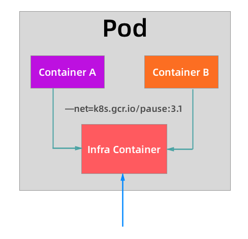
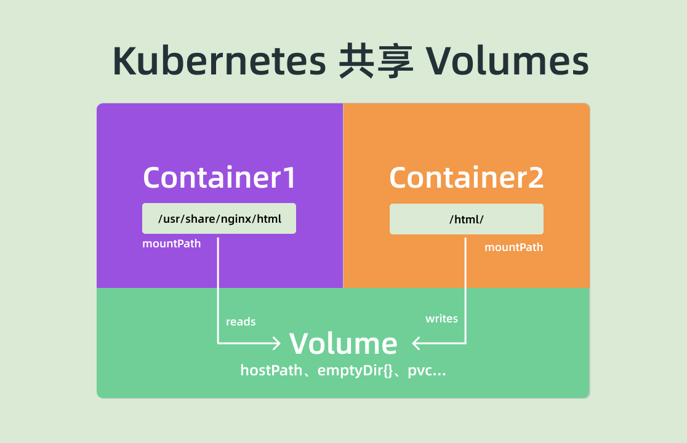
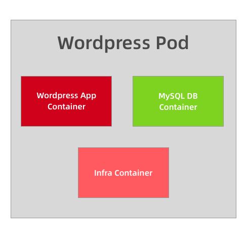
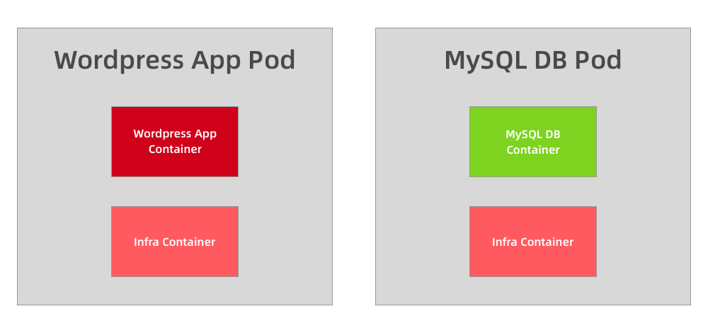

## Pod 

> Kubernetes 最基本的调度单元

> 

> 前面的课程中我们了解了 Kubernetes 的基本架构，以及如何使用资源清单在集群中部署一个应用。我们也了解到了 Pod 是 Kubernetes 集群中最基本的调度单元，我们平时在集群中部署的应用都是以 Pod 为单位的，而并不是我们熟知的容器，这样设计的目的是什么呢？为何不直接使用容器呢？

### 为什么需要 Pod 

> 假设 Kubernetes 中调度的基本单元就是容器，对于一个非常简单的应用可以直接被调度直接使用，没有什么问题，但是往往还有很多应用程序是由多个进程组成的，有的同学可能会说把这些进程都打包到一个容器中去不就可以了吗？理论上是可以实现的，但是不要忘记了 Docker 管理的进程是 pid=1 的主进程，其他进程死掉了就会成为僵尸进程，没办法进行管理了，这种方式本身也不是容器推荐的运行方式，一个容器最好`只干一件事情`，所以在真实的环境中不会使用这种方式。

> 那么我们就把这个应用的进程进行拆分，拆分成一个一个的容器总可以了吧？但是不要忘记一个问题，拆分成一个一个的容器后，是不是就有可能出现一个应用下面的某个进程容器被调度到了不同的节点上呀？往往我们应用内部的进程与进程间通信（通过 IPC 或者共享本地文件之类）都是要求在本地进行的，也就是需要在同一个节点上运行。

> 所以我们需要一个更高级别的结构来将这些容器绑定在一起，并将他们作为一个基本的调度单元进行管理，这样就可以保证这些容器始终在同一个节点上面，这也就是 Pod 设计的初衷。

### Pod 原理 

> 在一个 Pod 下面运行几个关系非常密切的容器进程，这样一来这些进程本身又可以收到容器的管控，又具有几乎一致的运行环境，也就完美解决了上面提到的问题。

> 其实 Pod 也只是一个逻辑概念，真正起作用的还是 Linux 容器的 Namespace 和 Cgroup 这两个最基本的概念，Pod 被创建出来其实是一组共享了一些资源的容器而已。首先 Pod 里面的所有容器，都是共享的同一个 Network Namespace，但是涉及到文件系统的时候，默认情况下 Pod 里面的容器之间的文件系统是完全隔离的，但是我们可以通过声明来共享同一个 Volume。

> 对于共享同一个 Network Namespace 这个概念是不是比较熟悉，我们之前在 Docker 网络模式的章节中讲解了网络的 Container 模式，我们可以指定新创建的容器和一个已经存在的容器共享一个 Network Namespace，在运行容器的时候只需要指定 

```
--net=container:目标容器名
```

 这个参数就可以了，但是这种模式有一个明显的问题那就是容器的启动有先后顺序问题，那么 Pod 是怎么来处理这个问题的呢？那就是加入一个中间容器（没有什么架构是加一个中间件解决不了的？），这个容器叫做 Infra 容器，而且这个容器在 Pod 中永远都是第一个被创建的容器，这样是不是其他容器都加入到这个 Infra 容器就可以了，这样就完全实现了 Pod 中的所有容器都和 Infra 容器共享同一个 Network Namespace 了，如下图所示：

> 

> 所以当我们部署完成 Kubernetes 集群的时候，首先需要保证在所有节点上可以拉取到默认的 Infra 镜像，默认情况下 Infra 镜像地址为 `k8s.gcr.io/pause:3.1`，这个容器占用的资源非常少，但是这个镜像默认是需要科学上网的，所以很多时候我们在部署应用的时候一直处于 `Pending` 状态，因为所有 Pod 最先启动的容器镜像都拉不下来，肯定启动不了，启动不了其他容器肯定也就不能启动了：

```
$ kubelet --help |grep infra
      --pod-infra-container-image string                                                                          The image whose network/ipc namespaces containers in each pod will use. This docker-specific flag only works when container-runtime is set to docker. (default "k8s.gcr.io/pause:1")
```

> 从上面图中我们可以看出普通的容器加入到了 Infra 容器的 Network Namespace 中，所以这个 Pod 下面的所有容器就是共享同一个 Network Namespace 了，普通容器不会创建自己的网卡，配置自己的 IP，而是和 Infra 容器共享 IP、端口范围等，而且容器之间的进程可以通过 lo 网卡设备进行通信：

*   也就是容器之间是可以直接使用 `localhost` 进行通信的；
*   看到的网络设备信息都是和 Infra 容器完全一样的；
*   也就意味着同一个 Pod 下面的容器运行的多个进程不能绑定相同的端口；
*   而且 Pod 的生命周期只跟 Infra 容器一致，而与容器 A 和 B 无关。

> 对于文件系统 Kubernetes 是怎么实现让一个 Pod 中的容器共享的呢？默认情况下容器的文件系统是互相隔离的，要实现共享只需要在 Pod 的顶层声明一个 Volume，然后在需要共享这个 Volume 的容器中声明挂载即可。

> 

> 比如下面的示例：

```
apiVersion: v1
kind: Pod
metadata:
  name: counter
spec:
  volumes: 
  - name: varlog
    hostPath: 
      path: /var/log/counter
  containers:
  - name: count
    image: busybox
    args:
    - /bin/sh
    - -c
    - >
      i=0;
      while true;
      do
        echo "$i: $(date)" >> /var/log/log;
        i=$((i+1));
        sleep 1;
      done
    volumeMounts:
    - name: varlog
      mountPath: /var/log
  - name: count-log
    image: busybox
    args: [/bin/sh, -c, 'tail -n+1 -f /var/log/log']
    volumeMounts:
    - name: varlog
      mountPath: /var/log
```

> 示例中我们在 Pod 的顶层声明了一个名为 varlog 的 `Volume`，而这个 `Volume` 的类型是 `hostPath`，也就意味这个宿主机的 `/var/log/counter` 目录将被这个 Pod 共享，共享给谁呢？在需要用到这个数据目录的容器上声明挂载即可，也就是通过 `volumeMounts` 声明挂载的部分，这样我们这个 Pod 就实现了共享容器的 `/var/log` 目录，而且数据被持久化到了宿主机目录上。

> 这个方式也是 Kubernetes 中一个非常重要的设计模式：`sidecar 模式`的常用方式。典型的场景就是容器日志收集，比如上面我们的这个应用，其中应用的日志是被输出到容器的 /var/log 目录上的，这个时候我们可以把 Pod 声明的 Volume 挂载到容器的 /var/log 目录上，然后在这个 Pod 里面同时运行一个 sidecar 容器，他也声明挂载相同的 Volume 到自己容器的 /var/log （或其他）目录上，这样我们这个 sidecar 容器就只需要从 /var/log 目录下面不断消费日志发送到 Elasticsearch 中存储起来就完成了最基本的应用日志的基本收集工作了。

> 除了这个应用场景之外使用更多的还是利用 Pod 中的所有容器共享同一个 Network Namespace 这个特性，这样我们就可以把 Pod 网络相关的配置和管理也可以交给一个 sidecar 容器来完成，完全不需要去干涉用户容器，这个特性在现在非常火热的 Service Mesh（服务网格）中应用非常广泛，典型的应用就是 Istio，不过也不用着急，后面也会和大家一起探讨的。

### 如何划分 Pod 

> 上面我们介绍了 Pod 的实现原理，了解到了应该把关系紧密的容器划分到同一个 Pod 中运行，那么怎么来区分关系紧密呢？举一个简单的示例，比如我们的 Wordpress 应用，是一个典型的前端服务器和后端数据服务的应用，那么你认为应该使用一个 Pod 还是两个 Pod 呢？

> 如果在同一个 Pod 中同时运行服务器程序和后端的数据库服务这两个容器，理论上肯定是可行的，但是不推荐这样使用，我们知道一个 Pod 中的所有容器都是同一个整体进行调度的，但是对于我们这个应用 Wordpress 和 MySQL 数据库一定需要运行在一起吗？当然不需要，我们甚至可以将 MySQL 部署到集群之外对吧？所以 Wordpress 和 MySQL 即使不运行在同一个节点上也是可行的，只要能够访问到即可。

> 

> 但是如果你非要强行部署到同一个 Pod 中呢？从某个角度来说是错误的，比如现在我们的应用访问量非常大，一个 Pod 已经满足不了我们的需求了，怎么办呢？扩容对吧，但是扩容的目标也是 Pod，并不是容器，比如我们再添加一个 Pod，这个时候我们就有两个 Wordpress 的应用和两个 MySQL 数据库了，而且这两个 Pod 之间的数据是互相独立的，因为 MySQL 数据库并不是简单的增加副本就可以共享数据了，所以这个时候就得分开部署了，采用第二种方案，这个时候我们只需要单独扩容 Wordpress 的这个 Pod，后端的 MySQL 数据库并不会受到扩容的影响。

> 

> 将多个容器部署到同一个 Pod 中的最主要参考就是应用可能由一个主进程和一个或多个的辅助进程组成，比如上面我们的日志收集的 Pod，需要其他的 sidecar 容器来支持日志的采集。所以当我们判断是否需要在 Pod 中使用多个容器的时候，我们可以按照如下的几个方式来判断：

*   这些容器是否一定需要一起运行，是否可以运行在不同的节点上
*   这些容器是一个整体还是独立的组件
*   这些容器一起进行扩缩容会影响应用吗

> 基本上我们能够回答上面的几个问题就能够判断是否需要在 Pod 中运行多个容器了。

> Pod 的设计

> 其实在我们理解 Pod 的时候，有一个比较好的类比的方式就是把 Pod 看成我们之前的 虚拟机，而容器就是虚拟机中运行的一个用户程序，这样就可以很好的来理解 Pod 的设计。