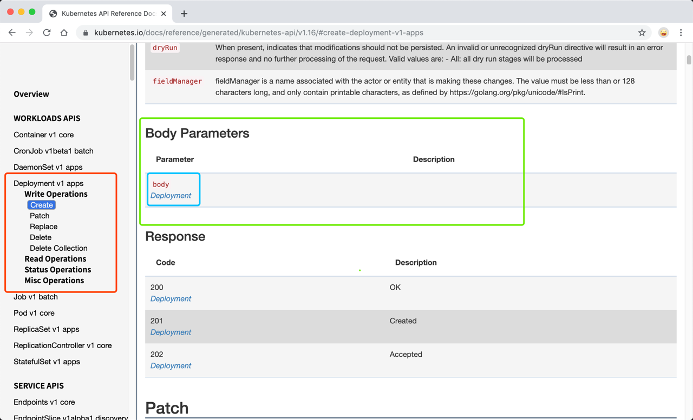
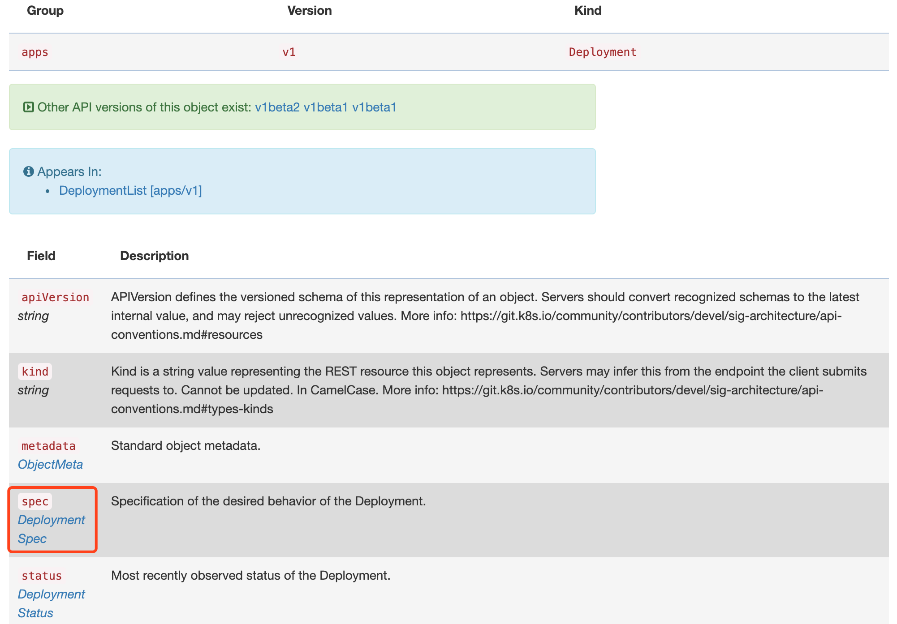
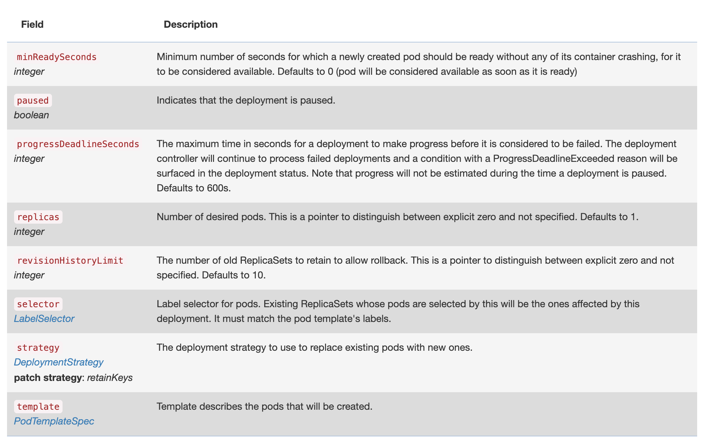

## YAML 文件 

> YAML 文件基本语法格式

> 前面我们得 Kubernetes 集群已经搭建成功了，现在我们就可以在集群里面来跑我们的应用了。要在集群里面运行我们自己的应用，首先我们需要知道几个概念。

> 第一个当然就是应用的镜像，因为我们在集群中运行的是容器，所以首先需要将我们的应用打包成镜像，前面的课程中我们已经学习过如何将应用打包成镜像，这里就不再赘述了。

> 镜像准备好了，Kubernetes 集群也准备好了，其实我们就可以把我们的应用部署到集群中了。但是镜像到集群中运行这个过程如何完成呢？必然有一个地方可以来描述我们的应用，然后把这份描述告诉集群，然后集群按照这个描述来部署应用。

> 在之前 Docker 环境下面我们是直接通过命令 `docker run` 来运行我们的应用的，在 Kubernetes 环境下面我们同样也可以用类似 `kubectl run` 这样的命令来运行我们的应用，但是在 Kubernetes 中却是不推荐使用命令行的方式，而是希望使用我们称为`资源清单`的东西来描述应用，资源清单可以用 YAML 或者 JSON 文件来编写，一般来说 YAML 文件更方便阅读和理解，所以我们的课程中都会使用 YAML 文件来进行描述。

> 通过一个资源清单文件来定义好一个应用后，我们就可以通过 kubectl 工具来直接运行它：

```
$ kubectl create -f xxxx.yaml
```

> 我们知道 kubectl 是直接操作 APIServer 的，所以就相当于把我们的清单提交给了 APIServer，然后集群获取到清单描述的应用信息后存入到 etcd 数据库中，然后 kube-scheduler 组件发现这个时候有一个 Pod 还没有绑定到节点上，就会对这个 Pod 进行一系列的调度，把它调度到一个最合适的节点上，然后把这个节点和 Pod 绑定到一起（写回到 etcd），然后节点上的 kubelet 组件这个时候 watch 到有一个 Pod 被分配过来了，就去把这个 Pod 的信息拉取下来，然后根据描述通过容器运行时把容器创建出来，最后当然同样把 Pod 状态再写回到 etcd 中去，这样就完成了一整个的创建流程。

### 第一个容器化应用 

> 比如现在我们通过 YAML 文件编写了一个如下的资源清单，命名为 nginx-deployment.yaml：

```
apiVersion: apps/v1  # API版本
kind: Deployment  # API对象类型
metadata:
  name: nginx-deploy
  labels:
    chapter: first-app
spec:
  selector:
    matchLabels:
      app: nginx
  replicas: 2  # Pod 副本数量
  template:  # Pod 模板
    metadata:
      labels:
        app: nginx
    spec:
      containers:
      - name: nginx
        image: nginx:9
        ports:
        - containerPort: 80
```

> 然后直接用 kubectl 命令来创建这个应用：

```
$ kubectl create -f nginx-deployment.yaml
deployment.apps/nginx-deploy created
$ kubectl get pods
NAME                            READY   STATUS    RESTARTS   AGE
nginx-deploy-54f57cf6bf-2fdjz   1/1     Running   0          7s
nginx-deploy-54f57cf6bf-57287   1/1     Running   0          7s
```

> 我们可以看到会在集群中生成两个 Pod 出来。而整个资源清单文件对应到 Kubernetes 中就是一个 API Object（API 对象），我们按照这些对象的要求填充上对应的属性后，提交给 Kubernetes 集群，就可以为我们创建出对应的资源对象，比如我们这里定义的是一个 Deployment 类型的 API 对象，我们按照这个 API 对象的要求填充了一些属性，就会为我们创建出对应的资源对象，我们可以通过下面的命令来获取：

```
$ kubectl get deployment
NAME           READY   UP-TO-DATE   AVAILABLE   AGE
nginx-deploy   2/2     2            2           12m
```

> Deployment 这个资源对象就是用来定义多副本应用的对象，而且还支持对每个副本进行滚动更新，上面我们的资源清单中的描述中有一个属性 `replicas: 2`，所以最后生成两个副本的 Pod。

> 而这个 Deployment 定义的副本 Pod 具体是什么样的，是通过下面的 Pod 模板来定义的，就是 template 下面的定义，这个模板中定义了我们的 Pod 中只有一个名为 nginx 的容器，容器使用的镜像是 `nginx:1.7.9`（spec.containers[0].image），并且这个容器监听的端口是 80（spec.containers[0].ports[0].containerPort），另外我们还为 Pod 添加了一个`app: nginx`这样的 Label 标签，这里需要非常注意的是上面的 `selector.matchLabels` 区域就是来表示我们的 Deployment 来管理哪些 Pod 的，所以这个地方需要和 Pod 模板中的 Label 标签保持一致，这个 Label 标签之前我们也提到过是非常重要的。

> 另外我们也可以发现每个 API 对象都有一个 `Metadata` 的字段，用来表示该对象的元数据的，比如定义 name、namespace 等，比如上面 Deployment 和 Pod 模板中都有这个字段，至于为什么 Pod 模板中没有 name 这个元信息呢，这是因为 Deployment 这个控制器会自动在他自己的 name 基础上生成 Pod 名，不过 Deployment 下面定义的 Label 标签就没有 Pod 中定义的 Label 标签那么重要了，只是起到一个对该对象标识和过滤的作用。比如我们在查询对象的时候可以带上标签来进行过滤：

```
$ kubectl get deployment -l chapter=first-app
NAME           READY   UP-TO-DATE   AVAILABLE   AGE
nginx-deploy   2/2     2            2           51m
$ kubectl get pods -l app=nginx
NAME                            READY   STATUS    RESTARTS   AGE
nginx-deploy-54f57cf6bf-2fdjz   1/1     Running   0          51m
nginx-deploy-54f57cf6bf-57287   1/1     Running   0          51m
```

> 到这里我们就完成了我们的第一个应用的容器化部署，但是往往我们在部署应用的过程中或多或少会遇到一些问题，这个时候我们可以使用一个 `kubectl describe` 命令来查看资源对象的详细信息，比如我们用下面的命令来查看 Pod 的详细信息：

```
$ kubectl describe pod nginx-deploy-54f57cf6bf-2fdjz
Name:         nginx-deploy-54f57cf6bf-2fdjz
Namespace:    default
Priority:     0
Node:         ydzs-node2/123
Start Time:   Sat, 09 Nov 2019 15:20:32 +0800
Labels:       app=nginx
              pod-template-hash=54f57cf6bf
Annotations:  <none>
Status:       Running
IP:           2199
IPs:
  IP:           2199
Controlled By:  ReplicaSet/nginx-deploy-54f57cf6bf
Containers:
  nginx:
    Container ID:   docker://e40e78eee7a431b6e7277b414967cce936ac750e2a8ba30298302cdd89e54300
    Image:          nginx:9
    Image ID:       docker-pullable://nginx@sha256:e3456c851a152494c3e4ff5fcc26f240206abac0c9d794affb40e0714846c451
    Port:           80/TCP
    Host Port:      0/TCP
    State:          Running
      Started:      Sat, 09 Nov 2019 15:20:35 +0800
    Ready:          True
    Restart Count:  0
    Environment:    <none>
    Mounts:
      /var/run/secrets/kubernetes.io/serviceaccount from default-token-5tsh4 (ro)
Conditions:
  Type              Status
  Initialized       True
  Ready             True
  ContainersReady   True
  PodScheduled      True
Volumes:
  default-token-5tsh4:
    Type:        Secret (a volume populated by a Secret)
    SecretName:  default-token-5tsh4
    Optional:    false
QoS Class:       BestEffort
Node-Selectors:  <none>
Tolerations:     node.kubernetes.io/not-ready:NoExecute for 300s
                 node.kubernetes.io/unreachable:NoExecute for 300s
Events:
  Type    Reason     Age        From                 Message
  ----    ------     ----       ----                 -------
  Normal  Scheduled  <unknown>  default-scheduler    Successfully assigned default/nginx-deploy-54f57cf6bf-2fdjz to ydzs-node2
  Normal  Pulled     52m        kubelet, ydzs-node2  Container image "nginx:9" already present on machine
  Normal  Created    52m        kubelet, ydzs-node2  Created container nginx
  Normal  Started    52m        kubelet, ydzs-node2  Started container nginx
```

> 我们可以看到看到很多这个 Pod 的详细信息，比如调度到的节点、状态、IP 等，一般我们比较关心的是下面的 `Events` 部分，就是我们说的`事件`。

> 在 Kubernetes 创建资源对象的过程中，对该对象的一些重要操作，都会被记录在这个对象的 `Events` 里面，可以通过 `kubectl describe` 指令查看对应的结果。所以这个指令也会是以后我们排错过程中会经常使用的命令，一定要记住这个重要的命令。比如上面我们描述的这个 Pod，我们可以看到它被创建之后，被调度器调度（Successfully assigned）到了 ydzs-node2 节点上，然后指定的镜像已经在该节点上存在了，所以没有再去拉取镜像，然后创建我们定义的 nginx 容器，最后启动定义的容器。

> 另外一个方面如果我们相对我们的应用进行升级的话应该怎么办呢？这个操作在我们日常工作中还是非常常见的，而在 Kubernetes 这里也是非常简单的，我们只需要修改我们的资源清单文件即可，比如我们把镜像升级到最新版本`nginx:latest`：

```
...    
    spec:
      containers:
      - name: nginx
        image: nginx:latest  # 这里被从 9 修改为latest
        ports:
      - containerPort: 80
```

> 然后我们可以通过`kubectl apply`命令来直接更新，这个命令也是推荐我们使用的，我们不必关心当前的操作是创建，还是更新，执行的命令始终是 `kubectl apply`，Kubernetes 则会根据 YAML 文件的内容变化，自动进行具体的处理，所以无论是创建还是更新都可以直接使用这个命令：

```
$ kubectl apply -f nginx-deployment.yaml
```

> 通过这个命令就可以来更新我们的应用了，由于我们这里使用的是一个 Deployment 的控制器，所以会滚动更新我们的应用，我们可以通过在命令后面加上 `--watch` 参数来查看 Pod 的更新过程：

```
$ kubectl get pods -l app=nginx --watch
NAME                            READY   STATUS              RESTARTS   AGE
nginx-deploy-54f57cf6bf-2fdjz   1/1     Terminating         0          72m
nginx-deploy-54f57cf6bf-57287   1/1     Running             0          72m
nginx-deploy-786b576769-69lrl   1/1     Running             0          4s
nginx-deploy-786b576769-wwmvz   0/1     ContainerCreating   0          2s
nginx-deploy-54f57cf6bf-2fdjz   0/1     Terminating         0          72m
nginx-deploy-786b576769-wwmvz   1/1     Running             0          3s
nginx-deploy-54f57cf6bf-57287   1/1     Terminating         0          72m
nginx-deploy-54f57cf6bf-57287   0/1     Terminating         0          72m
nginx-deploy-54f57cf6bf-57287   0/1     Terminating         0          72m
nginx-deploy-54f57cf6bf-57287   0/1     Terminating         0          72m
nginx-deploy-54f57cf6bf-2fdjz   0/1     Terminating         0          72m
nginx-deploy-54f57cf6bf-2fdjz   0/1     Terminating         0          72m
```

> 可以看到更新过程是先杀掉了一个 Pod，然后又重新创建了一个新的 Pod，然后又杀掉一个旧的 Pod，再创建一个新的 Pod，这样交替替换的，最后剩下两个新的 Pod，这就是我们所说的滚动更新，滚动更新对于我们的应用持续提供服务是非常重要的手段，在日常工作中更新应用肯定会采用这种方式。

> 最后，如果需要把我们的应用从集群中删除掉，可以用 `kubectl delete` 命令来清理：

```
$ kubectl delete -f nginx-deployment.yaml
```

### YAML 文件 

> 上面我们在 Kubernetes 中部署了我们的第一个容器化应用，我们了解到要部署应用最重要的就是编写应用的资源清单文件。那么如何编写资源清单文件呢？日常使用的时候我们都是使用 YAML 文件来编写，但是现状却是大部分同学对 JSON 更加熟悉，对 YAML 文件的格式不是很熟悉，所以也导致很多同学在编写资源清单的时候似懂非懂的感觉，所以在了解如何编写资源清单之前我们非常有必要来了解下 YAML 文件的用法。

> `YAML` 是专门用来写配置文件的语言，非常简洁和强大，远比 `JSON` 格式方便。`YAML`语言（发音 /ˈjæməl/）的设计目标，就是方便人类读写。它实质上是一种通用的数据串行化格式。

> 它的基本语法规则如下：

*   大小写敏感
*   使用缩进表示层级关系
*   缩进时不允许使用`Tab`键，只允许使用空格
*   缩进的空格数目不重要，只要相同层级的元素左侧对齐即可
*   `#` 表示注释，从这个字符一直到行尾，都会被解析器忽略

> 在 Kubernetes 中，我们只需要了解两种结构类型就行了：

*   Lists（列表）
*   Maps（字典）

> 也就是说，你可能会遇到 Lists 的 Maps 和 Maps 的 Lists，等等。不过不用担心，你只要掌握了这两种结构也就可以了，其他更加复杂的我们暂不讨论。

### Maps 

> 首先我们来看看 `Maps`，我们都知道 `Map` 是字典，就是一个 `key:value` 的键值对，`Maps` 可以让我们更加方便的去书写配置信息，例如：

```
---
apiVersion: v1
kind: Pod
```

> 第一行的`---`是分隔符，是可选的，在单一文件中，可用连续三个连字号`---`区分多个文件。这里我们可以看到，我们有两个键：kind 和 apiVersion，他们对应的值分别是：v1 和 Pod。上面的 YAML 文件转换成 JSON 格式的话，你肯定就容易明白了：

```
{
    "apiVersion": "v1",
    "kind": "pod"
}
```

> 我们在创建一个相对复杂一点的 YAML 文件，创建一个 KEY 对应的值不是字符串而是一个 Maps：

```
---
apiVersion: v1
kind: Pod
metadata:
  name: ydzs-site
  labels:
    app: web
```

> 上面的 YAML 文件，metadata 这个 KEY 对应的值就是一个 `Maps` 了，而且嵌套的 labels 这个 KEY 的值又是一个 Map，你可以根据你自己的情况进行多层嵌套。

> 上面我们也提到了 YAML 文件的语法规则，YAML 处理器是根据行缩进来知道内容之间的嗯关联性的。比如我们上面的 YAML 文件，`我用了两个空格作为缩进，空格的数量并不重要，但是你得保持一致，并且至少要求一个空格`（什么意思？就是你别一会缩进两个空格，一会缩进4个空格）。我们可以看到 name 和 labels 是相同级别的缩进，所以 YAML 处理器就知道了他们属于同一个 Map，而 app 是 labels 的值是因为 app 的缩进更大。

> 注意

> 注意：在 YAML 文件中绝对不要使用 tab 键来进行缩进。

> 同样的，我们可以将上面的 YAML 文件转换成 JSON 文件：

```
{
    "apiVersion": "v1",
    "kind": "Pod",
    "metadata": {
        "name": "kube100-site",
        "labels": {
            "app": "web"
        }
    }
}
```

> 或许你对上面的 JSON 文件更熟悉，但是你不得不承认 YAML 文件的语义化程度更高吧？

### Lists 

> `Lists`就是列表，说白了就是数组，在 YAML 文件中我们可以这样定义：

```
args
  - Cat
  - Dog
  - Fish
```

> 你可以有任何数量的项在列表中，每个项的定义以破折号（`-`）开头的，与父元素之间可以缩进也可以不缩进。对应的 JSON 格式如下：

```
{
    "args": [ 'Cat', 'Dog', 'Fish' ]
}
```

> 当然，Lists 的子项也可以是 Maps，Maps 的子项也可以是 Lists 如下所示：

```
---
apiVersion: v1
kind: Pod
metadata:
  name: ydzs-site
  labels:
    app: web
spec:
  containers:
    - name: front-end
      image: nginx
      ports:
        - containerPort: 80
    - name: flaskapp-demo
      image: cnych/flaskapp
      ports:
        - containerPort: 5000
```

> 比如这个 YAML 文件，我们定义了一个叫 containers 的 List 对象，每个子项都由 name、image、ports 组成，每个 ports 都有一个 key 为 containerPort 的 Map 组成，同样的，我们可以转成如下 JSON 格式文件：

```
{
    "apiVersion": "v1",
    "kind": "Pod",
    "metadata": {
        "name": "ydzs-site",
        "labels": {
            "app": "web"
        }
    },
    "spec": {
        "containers": [{
            "name": "front-end",
            "image": "nginx",
            "ports": [{
                "containerPort": "80"
            }]
        }, {
            "name": "flaskapp-demo",
            "image": "cnych/flaskapp",
            "ports": [{
                "containerPort": "5000"
            }]
        }]
    }
}
```

> 是不是觉得用 JSON 格式的话文件明显比 YAML 文件更复杂了呢？

### 如何编写资源清单 

> 上面我们了解了 YAML 文件的基本语法，现在至少可以保证我们的编写的 YAML 文件语法是合法的，那么要怎么编写符合 Kubernetes API 对象的资源清单呢？比如我们怎么知道 Pod、Deployment 这些资源对象有哪些功能、有哪些字段呢？

> 一些简单的资源对象我们可能可以凭借记忆写出对应的资源清单，但是 Kubernetes 发展也非常快，版本迭代也很快，每个版本中资源对象可能又有很多变化，那么有没有一种办法可以让我们做到有的放矢呢？

> 实际上是有的，最简单的方法就是查找 Kubernetes API 文档，比如我们现在使用的是 v1.16.2 版本的集群，可以通过地址 https://kubernetes.io/docs/reference/generated/kubernetes-api/v1.16/ 查找到对应的 API 文档，在这个文档中我们可以找到所有资源对象的一些字段。

> 比如我们要了解创建一个 Deployment 资源对象需要哪些字段，我们可以打开上面的 API 文档页面，在左侧侧边栏找到 `Deployment v1 apps`，点击下面的 `Write Operations`，然后点击 `Create`，然后我们查找到创建 Deployment 需要提交的 Body 参数

> 

> 然后点击 Body，进入到参数详情页：

> 

> 这个时候我们就可以看到我们创建 Deployment 需要的一些字段了，比如 apiVersion、kind、metadata、spec 等，而且每个字段都有对应的文档说明，比如我们像要了解 DeploymentSpec 下面有哪些字段，继续点击进去查看就行：

> 

> 每个字段具体什么含义以及每个字段下面是否还有其他字段都可以这样去追溯。

> 但是如果平时我们编写资源清单的时候都这样去查找文档势必会效率低下，Kubernetes 也考虑到了这点，我们可以直接通过 kubectl 命令行工具来获取这些字段信息，同样的，比如我们要获取 Deployment 的字段信息，我们可以通过 `kubectl explain` 命令来了解：

```
$ kubectl explain deployment
KIND:     Deployment
VERSION:  apps/v1

DESCRIPTION:
     Deployment enables declarative updates for Pods and ReplicaSets.

FIELDS:
   apiVersion   <string>
     APIVersion defines the versioned schema of this representation of an
     object. Servers should convert recognized schemas to the latest internal
     value, and may reject unrecognized values. More info:
     https://git.k8s.io/community/contributors/devel/sig-architecture/api-conventions.md#resources

   kind <string>
     Kind is a string value representing the REST resource this object
     represents. Servers may infer this from the endpoint the client submits
     requests to. Cannot be updated. In CamelCase. More info:
     https://git.k8s.io/community/contributors/devel/sig-architecture/api-conventions.md#types-kinds

   metadata <Object>
     Standard object metadata.

   spec <Object>
     Specification of the desired behavior of the Deployment.

   status   <Object>
     Most recently observed status of the Deployment.
```

> 我们可以看到上面的信息和我们在 API 文档中查看到的基本一致，比如我们看到其中 `spec` 字段是一个 `<Object>` 类型的，证明该字段下面是一个对象，我们可以继续去查看这个字段下面的详细信息：

```
$ kubectl explain deployment.spec
KIND:     Deployment
VERSION:  apps/v1

RESOURCE: spec <Object>

DESCRIPTION:
     Specification of the desired behavior of the Deployment.

     DeploymentSpec is the specification of the desired behavior of the
     Deployment.

FIELDS:
   minReadySeconds  <integer>
     Minimum number of seconds for which a newly created pod should be ready
     without any of its container crashing, for it to be considered available.
     Defaults to 0 (pod will be considered available as soon as it is ready)

   paused   <boolean>
     Indicates that the deployment is paused.

   progressDeadlineSeconds  <integer>
     The maximum time in seconds for a deployment to make progress before it is
     considered to be failed. The deployment controller will continue to process
     failed deployments and a condition with a ProgressDeadlineExceeded reason
     will be surfaced in the deployment status. Note that progress will not be
     estimated during the time a deployment is paused. Defaults to 600s.

   replicas <integer>
     Number of desired pods. This is a pointer to distinguish between explicit
     zero and not specified. Defaults to 

   revisionHistoryLimit <integer>
     The number of old ReplicaSets to retain to allow rollback. This is a
     pointer to distinguish between explicit zero and not specified. Defaults to

   selector <Object> -required-
     Label selector for pods. Existing ReplicaSets whose pods are selected by
     this will be the ones affected by this deployment. It must match the pod
     template's labels.

   strategy <Object>
     The deployment strategy to use to replace existing pods with new ones.

   template <Object> -required-
     Template describes the pods that will be created.
```

> 如果一个字段显示的是 `required`，这就证明该自动是必填的，也就是我们在创建这个资源对象的时候必须声明这个字段，每个字段的类型也都完全为我们进行了说明，所以有了 `kubectl explain` 这个命令我们就完全可以写出一个不熟悉的资源对象的清单说明了，这个命令我们也是必须要记住的，会在以后的工作中为我们提供很大的帮助。