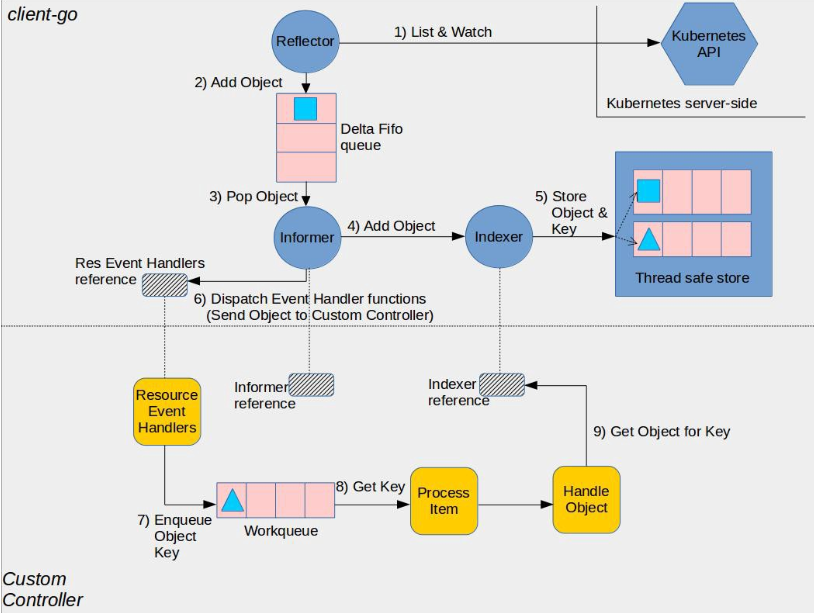
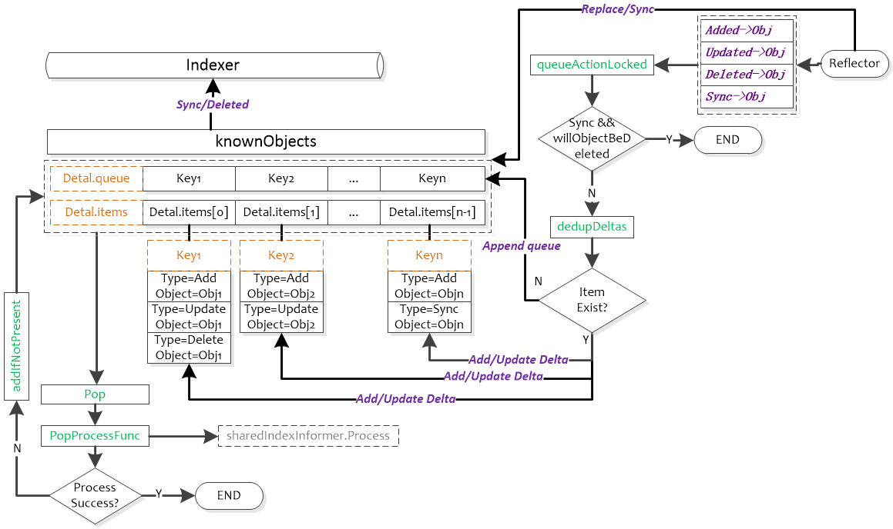

## DeltaFIFO

> 在介绍 Informer 之前，我们还得先介绍一个 `DeltaFIFO` 的概念，从下图可以看出来 `DeltaFIFO` 也包含在 Informer 中。

> 

> client-go 官方架构图：

> 

> DeltaFIFO 是一个生产者-消费者的队列，生产者是 Reflector，消费者是 Pop 函数，从架构图上可以看出 DeltaFIFO 的数据来源为 Reflector，通过 Pop 操作消费数据，消费的数据一方面存储到 Indexer 中，另一方面可以通过 Informer 的 handler 进行处理，Informer 的 handler 处理的数据需要与存储在 Indexer 中的数据匹配。需要注意的是，Pop 的单位是一个 Deltas，而不是 Delta。

> DetlaFIFO 同时实现了 Queue 和 Store 接口，使用 Deltas 保存了对象状态的变更（Add/Delete/Update）信息（如 Pod 的删除添加邓），Deltas 缓存了针对相同对象的多个状态变更信息，如 Pod 的 Deltas[0]可能更新了标签，Deltas[1]可能删除了该 Pod。最老的状态变更信息为 Oldest()，最新的状态变更信息为 Newest()，使用中，获取 DeltaFIFO 中对象的 key 以及获取 DeltaFIFO 都以最新状态为准。

### 接口

> Delta 我们可以简单理解为变化，在 client-go 中关于 Delta 的定义如下所示：

```
// client-go/tools/cache/delta_fifo.go
// DeltaType 是变化类型 (添加、删除等)
type DeltaType string

const (
    Added   DeltaType = "Added"  // 增加
    Updated DeltaType = "Updated"  // 更新
    Deleted DeltaType = "Deleted"  // 删除
    Sync DeltaType = "Sync"  // 同步
)

// Delta 是 DeltaFIFO 存储的类型，他告诉你发生了什么变化以及变化后对象的状态。
type Delta struct {
    Type   DeltaType  // Delta 类型
    Object interface{}  // 对象，Delta的粒度是一个对象
}
```

> Delta 其实就是 Kubernetes 中对象的变化（增、删、改、同步），FIFO 是一个先入先出的队列，那么 DeltaFIFO 就是一个按序的（先入先出）Kubernetes 对象变化的队列。除了 Delta 之外还有几个比较重要的类型如下所示：

```
// client-go/tools/cache/delta_fifo.go
// KeyLister 和 KeyGetter 的组合
type KeyListerGetter interface {
    KeyLister
    KeyGetter
}

// KeyLister 是一个通用的接口类型，只定义了一个接口函数
type KeyLister interface {
    ListKeys() []string  // 返回所有的keys
}

type KeyGetter interface {
    GetByKey(key string) (interface{}, bool, error)  // 通过 key 获取对象
}
```

> 其实我仔细观察会发现前面 Indexer 中提到的 cache（

```
client-go/tools/cache/store
```

）就实现了上面三个接口，上面三个接口基本上就是 kv 的标准接口，但凡是通过 kv 方式访问的对象(存储、队列、索引等)多半具备以上接口。肯定有人会问直接使用具体的类型不就完了么，定义这些有什么用？答案很简单，当你需要对 kv 的对象只读但是不关心具体实现时就用上了~

> 接下来再来认识一个类型：

```
// client-go/tools/cache/fifo.go
// Queue 才是 FIFO 的抽象，DeltaFIFO 是一种具体的实现，和 Store 相同，但也有一个Pop（）方法。
type Queue interface {
    Store  // 实现了存储接口，FIFO也是一种存储
    Pop(PopProcessFunc) (interface{}, error)  // 弹出对象
    AddIfNotPresent(interface{}) error  // 对象如果不在队列中就添加
    HasSynced() bool  // 通过Replace()放入第一批对象到队列中并且已经被Pop()全部取走
    Close()  // 关闭队列
}
```

> `Queue` 是在 Store 基础上扩展了 Pop 方法可以让对象有序的弹出，Indexer 是在 Store 基础上建立了索引，可以快速检索对象。

### 实现

> 上面是 Queue 的接口抽象定义，接下来我们来看下具体的实现 DeltaFIFO，对应的结构体定义如下所示：

```
// client-go/tools/cache/delta_fifo.go
type DeltaFIFO struct {
    lock sync.RWMutex  // 读写锁
    cond sync.Cond  // 给Pop()函数使用，在没有对象的时候可以阻塞，内部锁复用读写锁

    items map[string]Deltas // 按照kv的方式存储对象，但是存储的是对象的Deltas数组
    queue []string  // 为先入先出实现的，存储的是对象的键

    populated bool  // 通过 Replace() 接口将第一批对象放入队列，或者第一次调用增、删、改接口时标记为true
    initialPopulationCount int  // 通过 Replace() 接口将第一批对象放入队列的对象数量

    keyFunc KeyFunc  // 对象键计算函数

    knownObjects KeyListerGetter  // 其实就是 Indexer

    closed     bool  // 是否已经关闭的标记
    closedLock sync.Mutex
}
```

> 其中比较难理解的是 knownObjects，它的类型是 KeyListerGetter，这个接口中的 ListKeys 和 GetByKey 方法也是 Store 接口中的方法，所以 knownObjects 能够被赋值为实现了 Store 的类型指针；同样地，由于 Indexer 继承了 Store 方法，所以 knonwObjects 能够被赋值为实现了 Indexer 的类型指针。knownObjects 实际使用时是 Indexer，对应图中得 localStore。DeltaFIFO 根据其保存得对象状态变更消息处理（增/删/改/同步）knownObjects 中相应得对象。同步（Sync）Deltas 中即将被删除的对象是没有一样的。

> DeltaFIFO.knowObjects.GetByKey 就是执行的 store.go 中的 GetByKey 函数，用于获取 Indexer 中的对象键。

```
initialPopulationCount
```

 用于表示是否完成全量同步，在 Replace 函数中增加，在 Pop 函数中减小，当 initialPopulationCount 为 0 且 populated 为 true 时表示 Pop 了所有 Replace 添加到 DeltaFIFO 中的对象，populated 用于判断 DletaFIFO 是否为初始化状态（即没有处理过任何对象）。

> DeltaFIFO 的计算对象键的函数略有不同:

```
// client-go/tools/cache/delta_fifo.go
// KeyOf 暴露 f 的 keyFunc，但是也要检查 Deltas 对象的 key
func (f *DeltaFIFO) KeyOf(obj interface{}) (string, error) {
    // 先用 Deltas 做一次强制转换
    if d, ok := obj.(Deltas); ok {
        if len(d) == 0 {
            return "", KeyError{obj, ErrZeroLengthDeltasObject}
        }
        // 只用最新版本的对象
        obj = d.Newest().Object
    }
    if d, ok := obj.(DeletedFinalStateUnknown); ok {
        return d.Key, nil
    }
    return f.keyFunc(obj)
}
```

> DeltaFIFO 的计算对象键的方式为什么要先做一次 Deltas 的类型转换呢？原因很简单，那就是从 DeltaFIFO.Pop() 出去的对象很可能还要再添加进来（比如处理失败需要再放进来），此时添加的对象就是已经封装好的 Deltas。

> 既然 DeltaFIFO 是 Store 的一种实现，接下来我们来看下 DeltaFIFO 相应的实现：

```
// client-go/tools/cache/delta_fifo.go
// Add 添加元素到队列中
func (f *DeltaFIFO) Add(obj interface{}) error {
    f.lock.Lock()
    defer f.lock.Unlock()
    f.populated = true  // 队列第一次写入操作都要设置标记
    return f.queueActionLocked(Added, obj)
}

// Update 和 Add 一样，只是更新 Delta 对象
func (f *DeltaFIFO) Update(obj interface{}) error {
    f.lock.Lock()
    defer f.lock.Unlock()
    f.populated = true  // 队列第一次写入操作都要设置标记
    return f.queueActionLocked(Updated, obj)
}

// Delete 删除对象接口
func (f *DeltaFIFO) Delete(obj interface{}) error {
    // 获取对象的对象键
    id, err := f.KeyOf(obj)
    if err != nil {
        return KeyError{obj, err}
    }
    f.lock.Lock()
    defer f.lock.Unlock()
    f.populated = true  // 队列第一次写入操作都要设置标记
    // knownObjects 就是 Indexer，里面存有已知全部的对象
    if f.knownObjects == nil {
        // 没有 Indexer 就需要自己的存储对象来判断
        if _, exists := f.items[id]; !exists {
            return nil
        }
    } else {
        // 自己的对象或者Indexer里面有对象键就算存在
        _, exists, err := f.knownObjects.GetByKey(id)
        _, itemsExist := f.items[id]
        if err == nil && !exists && !itemsExist {
            // Presumably, this was deleted when a relist happened.
            // Don't provide a second report of the same deletion.
            return nil
        }
    }

    return f.queueActionLocked(Deleted, obj)
}

// 列举对象键接口
func (f *DeltaFIFO) ListKeys() []string {
    f.lock.RLock()
    defer f.lock.RUnlock()
    list := make([]string, 0, len(f.items))
    for key := range f.items {
        list = append(list, key)
    }
    return list
}

// 列举对象接口
func (f *DeltaFIFO) List() []interface{} {
    f.lock.RLock()
    defer f.lock.RUnlock()
    return f.listLocked()
}

// 列举对象的具体实现
func (f *DeltaFIFO) listLocked() []interface{} {
    list := make([]interface{}, 0, len(f.items))
    for _, item := range f.items {
        item = copyDeltas(item)
        list = append(list, item.Newest().Object)
    }
    return list
}

// 获取对象接口，比如说用 Service 对象获取 Pod 对象，因为他们的对象键是相同的
func (f *DeltaFIFO) Get(obj interface{}) (item interface{}, exists bool, err error) {
    key, err := f.KeyOf(obj)
    if err != nil {
        return nil, false, KeyError{obj, err}
    }
    return f.GetByKey(key)
}

// 通过对象键获取对象
func (f *DeltaFIFO) GetByKey(key string) (item interface{}, exists bool, err error) {
    f.lock.RLock()
    defer f.lock.RUnlock()
    d, exists := f.items[key]
    if exists {
        d = copyDeltas(d)
    }
    return d, exists, nil
}

// 判断是否关闭
func (f *DeltaFIFO) IsClosed() bool {
    f.closedLock.Lock()
    defer f.closedLock.Unlock()
    if f.closed {
        return true
    }
    return false
}
```

> 我们可以看到上面的实现大部分很简单，好几个方法的最终实现都是通过调用 `queueActionLocked` 函数实现的，如下所示：

```
// client-go/tools/cache/delta_fifo.go
// 从函数名称来看把“动作”放入队列中，这个动作就是 DeltaType，而且已经加锁了
func (f *DeltaFIFO) queueActionLocked(actionType DeltaType, obj interface{}) error {
    // 计算对象键的函数
    id, err := f.KeyOf(obj)
    if err != nil {
        return KeyError{obj, err}
    }
    // 如果是同步，并且对象未来会被删除，那么就直接返回，没必要记录这个动作了
    // 肯定有人会问为什么Add/Delete/Update这些动作可以，因为同步对于已经删除的对象是没有意义的
    // 已经删除的对象后续有可能添加、更新，因为同名的对象又被添加了，删除也是有可能
    if actionType == Sync && f.willObjectBeDeletedLocked(id) {
        return nil
    }
    // 对象操作，所以要追加到 Deltas 数组中
    newDeltas := append(f.items[id], Delta{actionType, obj})
    // 合并操作，去掉冗余的 delta
    newDeltas = dedupDeltas(newDeltas)
    // 判断对象是否已经存在
    _, exists := f.items[id]
    if len(newDeltas) > 0 {
        // 如果对象没有存在过，那就放入队列中，如果存在说明已经在 queue 中了，也就没必要再添加了
        if !exists {
            f.queue = append(f.queue, id)
        }
        // 更新 Deltas 数组，通知所有调用 Pop() 的人
        f.items[id] = newDeltas
        f.cond.Broadcast()
    } else if exists {
        // 直接把对象删除，这段代码我不知道什么条件会进来，因为dedupDeltas()肯定有返回结果的
        // 后面会有dedupDeltas()详细说明
        delete(f.items, id)
    }
    return nil
}
```

> 首先我们想想为什么每个对象一个 Deltas 而不是 Delta？对一个对象的多个操作，什么操作可以合并？

> DeltaFIFO 生产者和消费者是异步的，如果同一个目标的频繁操作，前面操作还缓存在队列中的时候，那么队列就要缓冲对象的所有操作，那可以将多个操作合并么？

> 对于更新这种类型的操作在没有全量基础的情况下是没法合并的，同时我们还不知道具体是什么类型的对象，所以能合并的也就是有添加/删除，两个添加/删除操作其实可以视为一个。

> 合并的操作如下所示：

```
// client-go/tools/cache/delta_fifo.go
// 合并 Deltas
func dedupDeltas(deltas Deltas) Deltas {
    // 小于2个delta，就没必要合并了
    n := len(deltas)
    if n < 2 {
        return deltas
    }
    // 取出最后两个
    a := &deltas[n-1]
    b := &deltas[n-2]
    // 判断如果是重复的，那就删除这两个 delta 把合并后的追加到 Deltas 数组尾部
    if out := isDup(a, b); out != nil {
        d := append(Deltas{}, deltas[:n-2]...)
        return append(d, *out)
    }
    return deltas
}

// 判断两个 Delta 是否重复
func isDup(a, b *Delta) *Delta {
    // 只有一个判断，判断是否为删除类操作（当前只有删除这一种能够合并）
    if out := isDeletionDup(a, b); out != nil {
        return out
    }
    return nil
}

// 判断是否为删除类的重复
func isDeletionDup(a, b *Delta) *Delta {
    // 二者有一个不是删除操作肯定不重复
    if b.Type != Deleted || a.Type != Deleted {
        return nil
    }
    // 理论上返回最后一个比较好，但是对象已经不再系统监控范围，前一个删除状态是好的
    if _, ok := b.Object.(DeletedFinalStateUnknown); ok {
        return a
    }
    return b
}
```

> 因为系统对于删除的对象有 

```
DeletedFinalStateUnknown
```

 这个状态，所以会存在两次删除的情况，但是两次添加同一个对象由于 apiserver 可以保证对象的唯一性，所以处理中就没有考虑合并两次添加操作。

> 接下来我们来看看 Replace() 函数的实现，这个也是 Store 定义的接口：

```
// client-go/tools/cache/delta_fifo.go
func (f *DeltaFIFO) Replace(list []interface{}, resourceVersion string) error {
    f.lock.Lock()
    defer f.lock.Unlock()
    keys := make(sets.String, len(list))
    // 遍历list
    for _, item := range list {
        // 获取对象键
        key, err := f.KeyOf(item)
        if err != nil {
            return KeyError{item, err}
        }
        // 用set保存所有的对象键
        keys.Insert(key)
        // 同步对象
        if err := f.queueActionLocked(Sync, item); err != nil {
            return fmt.Errorf("couldn't enqueue object: %v", err)
        }
    }
    // 如果没有Indexer存储的话，自己存储的就是所有的老对象，目的是要看哪些老对象不在全量集合中，那么就是删除的对象了
    if f.knownObjects == nil {
        // 遍历所有的元素
        queuedDeletions := 0
        for k, oldItem := range f.items {
            // 这个目标在输入的对象中存在就可以忽略
            if keys.Has(k) {
                continue
            }
            // 输入对象中没有，说明对象已经被删除了
            var deletedObj interface{}
            if n := oldItem.Newest(); n != nil {
                deletedObj = n.Object
            }
            queuedDeletions++
            // 队列中存储对象的Deltas数组中可能已经存在Delete了，避免重复，采用DeletedFinalStateUnknown类型
            if err := f.queueActionLocked(Deleted, DeletedFinalStateUnknown{k, deletedObj}); err != nil {
                return err
            }
        }
        // 如果 populated 还没有设置，说明是第一次并且还没有任何修改操作执行过
        if !f.populated {
            f.populated = true
            // 记录第一次传递过来的对象数量
            f.initialPopulationCount = len(list) + queuedDeletions
        }

        return nil
    }
    // 下面处理的就是检测某些目标删除但是 Delta 没有在队列中
    // 从存储中获取所有对象键
    knownKeys := f.knownObjects.ListKeys()
    queuedDeletions := 0
    for _, k := range knownKeys {
        // 对象还存在那就忽略
        if keys.Has(k) {
            continue
        }
        // 获取对象
        deletedObj, exists, err := f.knownObjects.GetByKey(k)
        if err != nil {
            deletedObj = nil
            klog.Errorf("Unexpected error %v during lookup of key %v, placing DeleteFinalStateUnknown marker without object", err, k)
        } else if !exists {
            deletedObj = nil
            klog.Infof("Key %v does not exist in known objects store, placing DeleteFinalStateUnknown marker without object", k)
        }
        // 累积删除的对象数量
        queuedDeletions++
        // 把对象删除的Delta放入队列
        if err := f.queueActionLocked(Deleted, DeletedFinalStateUnknown{k, deletedObj}); err != nil {
            return err
        }
    }
    // 和上面的代码差不多，只是计算initialPopulationCount值的时候增加了删除对象的数量
    if !f.populated {
        f.populated = true
        f.initialPopulationCount = len(list) + queuedDeletions
    }
    return nil
}
```

> 从 Replace() 的实现来看，主要用于实现对象的全量更新。这个可以理解为 DeltaFIFO 在必要的时候做一次全量更新，这个时刻可以是定期的，也可以是事件触发的。由于 DeltaFIFO 对外输出的就是所有目标的增量变化，所以每次全量更新都要判断对象是否已经删除，因为在全量更新前可能没有收到目标删除的请求。这一点与 cache 不同，cache 的 Replace() 相当于重建，因为cache 就是对象全量的一种内存映射，所以 Replace() 就等于重建。

> 那我来问题一个非常有水平的问题，为什么 knownObjects 为 nil 时需要对比队列和对象全量来判断对象是否删除，而knownObjects 不为空的时候就不需要了？如果读者想判断自己是否已经全部理解可以不看下面自己想想。

> 我们前面说过，knownObjects 就是 Indexer(具体实现是 cache)，而开篇的那副图已经非常明确的描述了二者以及使用之间的关系。也就是说 knownObjects 有的对象就是使用者知道的所有对象，此时即便队列(DeltaFIFO)中有相应的对象，在更新的全量对象中又被删除了，那就没必要通知使用者对象删除了，这种情况可以假想为系统短时间添加并删除了对象，对使用者来说等同于没有这个对象。

> =======

> ListWatch 的 list 步骤会调用 Replace（client-go/tools/cache/delta_fifo.go）函数来对 DeltaFIFO 进行全量更新：

*   Sync 所有 DeltaFIFO 中的对象，将输入对象全部加入到 DeltaFIFO
*   如果 knowObjects 为空，则删除 DeltaFIFO 中不存在于输入对象的对象，使 DeltaFIFO 中的有效对象（非 DeletedFinalStateUnknown）等同于输入对象
*   如果 knownObjects 非空，获取 knowObjects 中不存在于输入对象的对象，并在 DeltaFIFO 中删除这些对象

> 第2步好理解，knownObjects 为空，只需要更新 DeltaFIFO 即可。第3步中，当 knownObjects 非空时，需要以 knowObjects 为基准进行对象的删除，否则会造成 indexer 中的数据与 apiserver 的数据不一致，举个例子，比如 knownObjects 中的对象为 {obj1, obj2, obj3}，而 DeltaFIFO中待处理的对象为 {obj2, obj3,obj4}，如果仅按照2步骤进行处理，会导致 knownObjects 中残留 obj1，因此需要在 DeltaFIFO 中添加删除 obj1 的变更消息。从下面 ShareInformer 的图中可以看出，knownObjects（即Indexer）的数据只能通过 DeltaFIFO 变更。

> 