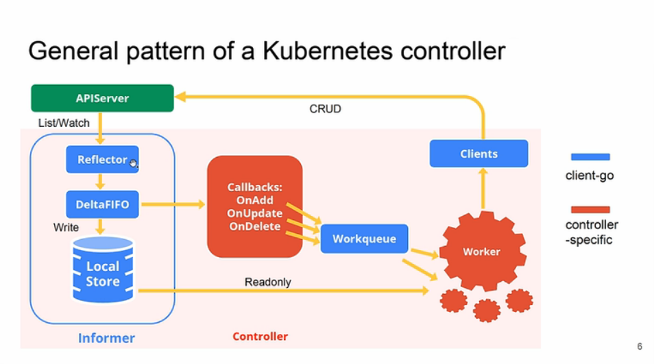
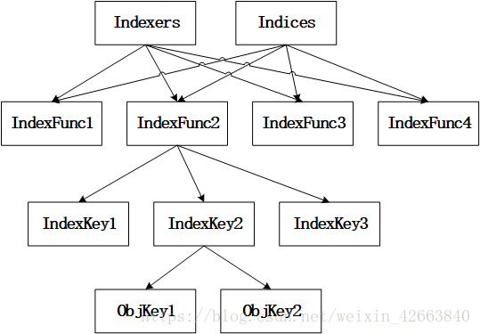

## Indexer

> `Indexer` 是 `Informer` 中一部分，`Informer` 在 client-go 中是非常重要的部分，但是由于 Informer 内容比较庞大，我们这里先介绍 Indexer，从字面上看是索引器的意思，他所在的位置就是 Informer 的 `LocalStore`，其实 Indexer 就是存储。

> 

> 和数据库类似索引和存储是息息相关的，索引构建在存储之上，可以让我们按照某些条件查询数据的时候会很快。

> 在了解 `Indexer` 之前我们需要先看几个重要的类型来了解 Indexer 是如何实现索引的：

```
// client-go/tools/cache/index.go
// IndexFun 知道如何为对象提供索引值，说白了就是计算对象的索引，传入对象，输出字符串索引数组
type IndexFunc func(obj interface{}) ([]string, error)

type Index map[string]sets.String   // 每种计算索引的方式会输出多个索引(数组)，而多个目标可能会算出相同索引
// 索引键 -> 对象键set集合

// Indexers 映射一个名字到一个 IndexFunc
type Indexers map[string]IndexFunc  // 计算索引的函数有很多，用名字来进行分类，就是索引分类
// 分类1(特征1) -> 获取对象的索引键(数组)

// Indices 映射一个名字到一个Index
type Indices map[string]Index    // 由于有多种计算索引的方式，那就又要按照计算索引的方式组织索引
// 分类1(特征1) -> 所有索引
```

> Indexers：分类1 -> IndexFunc([indexKey1，indexKey2....]) Indices： 分类1 -> Index indexKey1 -> [objKey1, objKey2...] indexKey2 -> [objKey3, objKey4...]

> 上面几种类型理解起来有点费劲，命名看上去也差不多。索引的目的就是为了快速查找，这个是毋庸置疑的，比如我们需要查找某个节点上的所有 Pod，那就要 Pod 按照节点名称排序，对应上面的 Index 类型就是 map[nodename]sets.podname，但是我们可能有很多种查找方式，这就是 Indexers 这个类型的作用了。

> 

> `Indexers` 和 `Indices` 都是按照 IndexFunc 分组，每个 IndexFunc 输出多个 IndexKey，产生相同 IndexKey 的多个对象存储在一个集合中。为了明确意义，我们这里先统一几个概念：

*   IndexFunc1...这些都是索引函数的名称，我们称之为索引类，大概意思就是把索引分类了
*   IndexKey1...这些是同一个对象在同一个索引类中的多个索引键值，我们称之为索引键
*   ObjKey1...这些是对象键，每个对象都有唯一的名称

> 现在我们再来查看 `Indexer` 与索引相关的接口定义：

```
// client-go/tools/cache/index.go
// Indexer 是一个存储接口，可以让我们使用多个索引函数来获取对象列表
type Indexer interface {
    Store  // 继承了 Storge 这个接口（client-go/tools/cache/store.go）

    // indexName 索引类，obj 是对象，计算 obj 在 indexName 索引类中的索引键
    // 通过索引键把所有对象取出来，基本就是获取符合 obj 特征的所有对象，所谓的特征就是对象在索引类中的索引键
    Index(indexName string, obj interface{}) ([]interface{}, error)  

    // indexKey 是 indexName 索引类中的一个索引键，函数返回 indexKey 指定的所有对象键
    // 这个对象键是 Indexer 内唯一的，在添加的时候会技术
    IndexKeys(indexName, indexKey string) ([]string, error)  

    // 获取 indexName 索引类中的所有索引键
    ListIndexFuncValues(indexName string) []string  

    // 与 Index 函数类似，只是返回值不是对象键了，而是所有对象
    ByIndex(indexName, indexKey string) ([]interface{}, error)

    // 返回 Indexers
    GetIndexers() Indexers

    // 添加 Indexers 到存储(store)中，即添加索引分类
    AddIndexers(newIndexers Indexers) error
}
```

> 上面是 `Indexer` 这个接口的定义，其中继承了 `Store` 这个接口，我们再来看看该接口的定义：

```
// client-go/tools/cache/store.go
type Store interface {
    // 添加对象
    Add(obj interface{}) error
    // 更新对象
    Update(obj interface{}) error
    // 删除对象
    Delete(obj interface{}) error
    // 列举对象
    List() []interface{}
    // 列举对象键
    ListKeys() []string
    // 获取 obj 相同对象键的对象，对象键是通过对象计算出来的字符串
    Get(obj interface{}) (item interface{}, exists bool, err error)
    // 通过对象键直接获取对象
    GetByKey(key string) (item interface{}, exists bool, err error)

    // 用 []interface{} 替换 Store 存储的所有对象，相当于会删除存储中原有的所有内容，然后再添加新的对象 
    Replace([]interface{}, string) error
    // 重新同步
    Resync() error
}
```

> 从上面接口中我们可以看出每个对象都要有唯一的键，键的计算方式就要依赖具体的实现了。接下来我们就来看看 `Indexer` 的具体实现。

### cache

> `cache` 是 `Indexer` 中非常经典的一种实现，所有的对象缓存在内存中，从名称来看可以知道是属于包内私有的内型，外部无法直接使用，需要通过专用的函数来创建，`cache` 的定义如下所示：

```
// client-go/tools/cache/store.go
// cache 仅用于下面两个方面：
//   通过 keyFunc 计算对象键值
//   调用 ThreadSafeStorage 接口的方法
type cache struct {
    // 一个线程安全的 Store
    cacheStorage ThreadSafeStore  
    // keyFunc 是一个用来计算对象键的函数
    keyFunc KeyFunc
}

// KeyFunc 的定义如下所示：用来计算对象键的函数
type KeyFunc func(obj interface{}) (string, error)
```

> 从 `cache` 结构体可以看出创建该对象的时候我们需要指定这个 `KeyFunc` 计算对象键的函数这个字段。另外一个就是一个线程安全的 `ThreadSafeStore` 对象。

### ThreadSafeStore

> 从 `cache` 的定义可以看出所有的功能基本上都是通过 `ThreadSafeStore` 这个类型来实现的，这里我们就先来看下该接口的定义：

```
// client-go/tools/cache/thread_safe_store.go
type ThreadSafeStore interface {
    Add(key string, obj interface{})
    Update(key string, obj interface{})
    Delete(key string)
    Get(key string) (item interface{}, exists bool)
    List() []interface{}
    ListKeys() []string
    Replace(map[string]interface{}, string)
    Index(indexName string, obj interface{}) ([]interface{}, error)
    IndexKeys(indexName, indexKey string) ([]string, error)
    ListIndexFuncValues(name string) []string
    ByIndex(indexName, indexKey string) ([]interface{}, error)
    GetIndexers() Indexers

    AddIndexers(newIndexers Indexers) error
    Resync() error
}
```

> 我们仔细观察会发现该接口和上面的 `Indexer` 基本上是一致的，不同的是 `Indexer` 中的 CRUD 的相关参数是对象，而这里是提供对象键。`ThreadSafeStore` 接口的对应实现结构体定义如下所示：

```
// client-go/tools/cache/thread_safe_store.go
// threadSafeMap 实现了 ThreadSafeStore 接口
type threadSafeMap struct {
    lock  sync.RWMutex  // 读写锁，读多写少用读写锁性能更好
    items map[string]interface{}  // 存储对象的字典：对象键：对象

    indexers Indexers  // 索引分类
    indices Indices // 快速索引表，通过所以可以快速找到对象键，然后再从items中取出对象
}
```

> 再次强调下索引键和对象键这两个重要的概念，索引键是用于对象快速查找的，经过索引键在 map 中排序查找会更快；对象键是对象在存储中的唯一命名，对象是通过名字+对象的方式存储的。接下来看下具体的实现函数：

```
// client-go/tools/cache/thread_safe_store.go
// 添加对象函数
func (c *threadSafeMap) Add(key string, obj interface{}) {
    // 加锁，因为是写操作，所以全部互斥
    c.lock.Lock()
    defer c.lock.Unlock()
    // 取出老对象
    oldObject := c.items[key]
    // 写入新对象
    c.items[key] = obj
    // 添加了新的对象所以需要更新索引
    c.updateIndices(oldObject, obj, key)
}

// 更新对象函数，和Add函数一模一样
func (c *threadSafeMap) Update(key string, obj interface{}) {
    c.lock.Lock()
    defer c.lock.Unlock()
    oldObject := c.items[key]
    c.items[key] = obj
    c.updateIndices(oldObject, obj, key)
}

// 删除对象
func (c *threadSafeMap) Delete(key string) {
    c.lock.Lock()
    defer c.lock.Unlock()
    // 判断对象是否存在
    if obj, exists := c.items[key]; exists {
        // 删除对象的索引
        c.deleteFromIndices(obj, key)
        // 删除对象本身
        delete(c.items, key)
    }
}

// 获取对象
func (c *threadSafeMap) Get(key string) (item interface{}, exists bool) {
    c.lock.RLock()
    defer c.lock.RUnlock()
    item, exists = c.items[key]
    return item, exists
}

// 列举对象
func (c *threadSafeMap) List() []interface{} {
    c.lock.RLock()
    defer c.lock.RUnlock()
    // 直接遍历对象map
    list := make([]interface{}, 0, len(c.items))
    for _, item := range c.items {
        list = append(list, item)
    }
    return list
}

// 列举对象键
func (c *threadSafeMap) ListKeys() []string {
    c.lock.RLock()
    defer c.lock.RUnlock()
    // 同样遍历对象map，只需要对象键值
    list := make([]string, 0, len(c.items))
    for key := range c.items {
        list = append(list, key)
    }
    return list
}

// 替换所有对象，相当于重新构造了一次
func (c *threadSafeMap) Replace(items map[string]interface{}, resourceVersion string) {
    c.lock.Lock()
    defer c.lock.Unlock()
    // 直接覆盖以前的对象
    c.items = items

    // 重建所有索引
    c.indices = Indices{}
    for key, item := range c.items {
        c.updateIndices(nil, item, key)
    }
}
```

> 然后就是和索引相关的函数，比如 `Index` 函数：

```
// client-go/tools/cache/thread_safe_store.go
// Index 通过指定的索引函数计算对象的索引键，然后把索引键的对象全部取出来
func (c *threadSafeMap) Index(indexName string, obj interface{}) ([]interface{}, error) {
    // 只读，所以用读锁即可
    c.lock.RLock()
    defer c.lock.RUnlock()
    // 从索引分类中取出indexName这个分类索引函数
    indexFunc := c.indexers[indexName]
    if indexFunc == nil {
        return nil, fmt.Errorf("Index with name %s does not exist", indexName)
    }
    // 获取对象的索引键
    indexKeys, err := indexFunc(obj)
    if err != nil {
        return nil, err
    }
    // 取出indexName这个分类的所有索引
    index := c.indices[indexName]
    // 声明对象的对象键集合
    var returnKeySet sets.String  // string类型的set
    if len(indexKeys) == 1 {
        // 在大多数情况下，只有一个值匹配
        // 优化下最常见的路径 - 此处不需要重复数据消除
        returnKeySet = index[indexKeys[0]]
    } else {
        // 需要对返回列表进行消重
        returnKeySet = sets.String{}
        for _, indexKey := range indexKeys {
            for key := range index[indexKey] {
                returnKeySet.Insert(key)
            }
        }
    }
    // 通过对象键把对象取出来
    list := make([]interface{}, 0, returnKeySet.Len())
    for absoluteKey := range returnKeySet {
        list = append(list, c.items[absoluteKey])
    }
    return list, nil
}
```

> 比如我们要取出一个节点上的所有 Pod，这就是一个特征，indexName 就是一个特征名，

```
indexFunc = c.indexers[indexName]
```

 就是获取到索引计算函数，然后通过这个函数可以计算得到这个对象的索引键，然后通过 `indices` 取出该特征下面的所有索引，然后循环索引键，通过索引把所有的对象键取出来，然后通过对象键把所有对象取出来。

> 然后

```
// client-go/tools/cache/thread_safe_store.go
// ByIndex 直接通过索引键来获取对象列表，和上面比较类似
func (c *threadSafeMap) ByIndex(indexName, indexKey string) ([]interface{}, error) {
    c.lock.RLock()
    defer c.lock.RUnlock()
    // 获取 indexName 的索引分类函数
    indexFunc := c.indexers[indexName]
    if indexFunc == nil {
        return nil, fmt.Errorf("Index with name %s does not exist", indexName)
    }
    // 获取分类的所有索引
    index := c.indices[indexName]
    // 直接通过索引键去取所有的对象键
    set := index[indexKey]
    // 遍历对象键输出对象
    list := make([]interface{}, 0, set.Len())
    for key := range set {
        list = append(list, c.items[key])
    }

    return list, nil
}
```

> 这个函数和上面的 Index 函数基本类似，功能更加简单，直接通过索引键获取全部对象。然后接下来是 `IndexKeys` 和 `ListIndexFuncValues` 这两个函数，如下所示：

```
// client-go/tools/cache/thread_safe_store.go
// IndexKeys 根据索引键获得对应的对象键列表
func (c *threadSafeMap) IndexKeys(indexName, indexKey string) ([]string, error) {
    c.lock.RLock()
    defer c.lock.RUnlock()
    // 获得索引分类的索引键计算函数
    indexFunc := c.indexers[indexName]
    if indexFunc == nil {
        return nil, fmt.Errorf("Index with name %s does not exist", indexName)
    }
    // 获取索引分类的所有索引
    index := c.indices[indexName]
    // 通过索引键获取所有的对象键
    set := index[indexKey]
    return set.List(), nil
}

// client-go/tools/cache/thread_safe_store.go
// 用来获取索引分类中的所有索引键
func (c *threadSafeMap) ListIndexFuncValues(indexName string) []string {
    c.lock.RLock()
    defer c.lock.RUnlock()
    // 根据索引分类获取所有的索引
    index := c.indices[indexName]
    names := make([]string, 0, len(index))
    // 遍历输出索引键
    for key := range index {
        names = append(names, key)
    }
    return names
}
```

> 其他函数都比较简单，除此之外，还有两个非常重要的函数，用来更新索引的操作，如下所示：

```
// client-go/tools/cache/thread_safe_store.go
// updateIndices 当有对象添加或者更新时，需要更新索引，因为调用该函数的函数已经加锁了，所以这个函数没有加锁操作
func (c *threadSafeMap) updateIndices(oldObj interface{}, newObj interface{}, key string) {
    // 如果有老对象，那么就要先删除老对象的索引
    if oldObj != nil {
        c.deleteFromIndices(oldObj, key)
    }
    // 遍历所有的分类索引函数，因为要为对象在所有的索引分类中创建索引键
    for name, indexFunc := range c.indexers {
        // 计算新对象的索引键
        indexValues, err := indexFunc(newObj)
        if err != nil {
            panic(fmt.Errorf("unable to calculate an index entry for key %q on index %q: %v", key, name, err))
        }
        // 获得索引分类的所有索引
        index := c.indices[name]
        // 为空说明这个索引分类还没有任何索引
        if index == nil {
            // 初始化一个空索引
            index = Index{}
            c.indices[name] = index
        }
        // 遍历索引键
        for _, indexValue := range indexValues {
            // 获取索引键的对象键集合
            set := index[indexValue]
            // 为空说明这个索引键下面还没有任何对象
            if set == nil {
                // 创建对象键集合
                set = sets.String{}
                index[indexValue] = set
            }
            // 把对象键插入到对象键集合中
            set.Insert(key)
        }
    }
}

// deleteFromIndices 删除对象的索引
func (c *threadSafeMap) deleteFromIndices(obj interface{}, key string) {
    // 遍历所有索引分类函数
    for name, indexFunc := range c.indexers {
        // 计算对象的索引键
        indexValues, err := indexFunc(obj)
        if err != nil {
            panic(fmt.Errorf("unable to calculate an index entry for key %q on index %q: %v", key, name, err))
        }
        // 获取索引分类的所有索引
        index := c.indices[name]
        if index == nil {
            continue
        }
        // 遍历对象的索引键
        for _, indexValue := range indexValues {
            // 获取索引键对应的对象键集合
            set := index[indexValue]
            if set != nil {
                // 把对象键从集合中删除
                set.Delete(key)
            }
        }
    }
}
```

> 上面就是关于 `ThreadSafeStore` 这个接口的一些说明以及对应的实现。最主要的还是需要理解 `Indices`、`Indexers`、`Index` 以及 `IndexFunc` 这几个类型的定义。

> 上面我提到了 `cache` 的大部分实现都是通过 `ThreadSafeStore` 操作的，所以 `cache` 本身比较简单，可以在

```
client-go/tools/cache/store.go
```

 下面查看具体的实现。

### 索引函数

> 通过上面的分析，我们可以了解到 Indexer 的核心就是各种索引函数的定义了。在 Kubernetes 中主要有以下几种索引函数：

1.  ```
    MetaNamespaceIndexFunc
    ```

    ，定义在 

    ```
    client-go/tools/cache/index.go
    ```

     下面，是一个`默认`的索引函数，它基于对象的命名空间进行索引，也就是所有对象以 namespace 作为索引键。
2.  `indexByPodNodeName`，定义在 

    ```
    kubernetes/pkg/controller/daemon/daemon_controller.go
    ```

     下面，该索引函数计算的是 Pod 对象所在节点的名字。

> ```
MetaNamespaceIndexFunc
```

 是默认的索引函数，也就是在索引中大部分就一个分类，这个分类的索引键就是 `namesapce`。对应的 `Indexers` 如下所示：

```
Indexers{"namespace": MetaNamespaceIndexFunc}
```

> ```
MetaNamespaceIndexFunc
```

 函数定义如下：

```
// client-go/tools/cache/index.go
func MetaNamespaceIndexFunc(obj interface{}) ([]string, error) {
    meta, err := meta.Accessor(obj)
    if err != nil {
        return []string{""}, fmt.Errorf("object has no meta: %v", err)
    }
    return []string{meta.GetNamespace()}, nil
}
```

> Indexers：namespace -> IndexFunc([kube-system]) Indices： namespace -> Index (kube-system -> [objKey1, objKey2...])

> 可以看到这个索引函数其实很简单，就是返回资源对象的命名空间而已。那么有人肯定会问，如果这样的话，所有的对象都存在一个 namesapce 索引键下面，这样的效率岂不是太低了？其实 client-go 为每类对象都创建了 `Informer`（Informer 内有 Indexer），所以即便存储在相同 namesapce 下的对象都是同一类，这个问题自然也就没有了。

> 另外大家一定要区分 

```
MetaNamespaceIndexFunc
```

 和 `MetaNamespaceKeyFunc` 的区分，第一个索引键计算函数，第二个是对象键计算函数，第一个返回的是 namespace，第二个返回的是对象包含 namespace 在内的对象全称。`MetaNamespaceKeyFunc` 函数的定义如下所示：

```
// client-go/tools/cache/store.go
// MetaNamespaceKeyFunc 是一个默认的 KeyFunc，它知道如何为实现 meta.Interface 接口的 API 对象生成键。键使用格式 <namespace>/<name>（除非<namespace>为空，值就是 <name>）
func MetaNamespaceKeyFunc(obj interface{}) (string, error) {
    if key, ok := obj.(ExplicitKey); ok {
        return string(key), nil
    }
    meta, err := meta.Accessor(obj)
    if err != nil {
        return "", fmt.Errorf("object has no meta: %v", err)
    }
    if len(meta.GetNamespace()) > 0 {
        return meta.GetNamespace() + "/" + meta.GetName(), nil
    }
    return meta.GetName(), nil
}
```

> 接下来我们就来和大家一起来分析 `Informer` 在 client-go 中的使用。