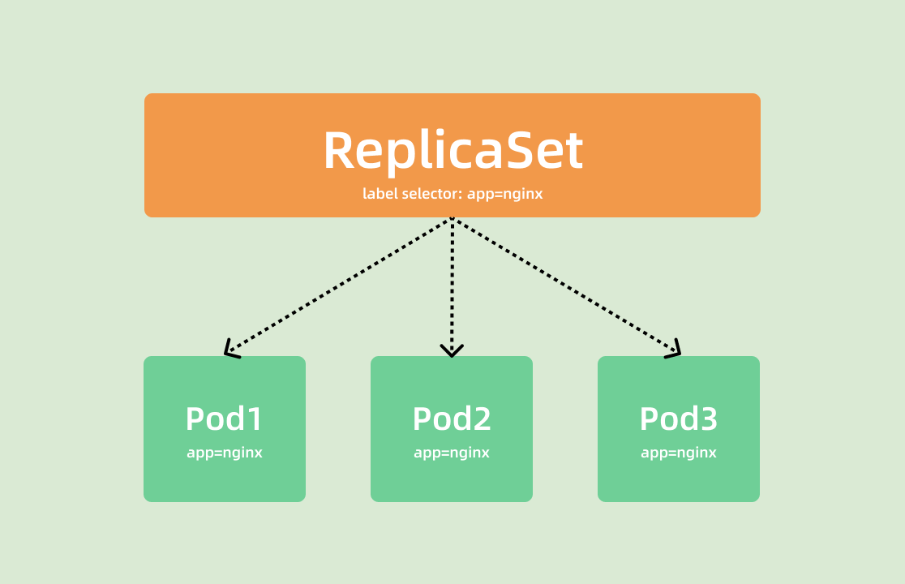


## ReplicaSet 控制器 

> 前面我们一起学习了 Pod 的原理和一些基本使用，但是在实际使用的时候并不会直接使用 Pod，而是会使用各种控制器来满足我们的需求，Kubernetes 中运行了一系列控制器来确保集群的当前状态与期望状态保持一致，它们就是 Kubernetes 的大脑。例如，ReplicaSet 控制器负责维护集群中运行的 Pod 数量；Node 控制器负责监控节点的状态，并在节点出现故障时及时做出响应。总而言之，在 Kubernetes 中，每个控制器只负责某种类型的特定资源。

### 控制器 

> Kubernetes 控制器会监听资源的 `创建/更新/删除` 事件，并触发 `Reconcile` 函数作为响应。整个调整过程被称作 

```
Reconcile Loop（调谐循环）
```

 或者 `Sync Loop（同步循环）`。Reconcile 是一个使用资源对象的命名空间和资源对象名称来调用的函数，使得资源对象的实际状态与 资源清单中定义的状态保持一致。调用完成后，Reconcile 会将资源对象的状态更新为当前实际状态。我们可以用下面的一段伪代码来表示这个过程：

```
for {
  desired := getDesiredState()  // 期望的状态
  current := getCurrentState()  // 当前实际状态
  if current == desired {  // 如果状态一致则什么都不做
    // nothing to do
  } else {  // 如果状态不一致则调整编排，到一致为止
    // change current to desired status
  }
}
```

> 这个编排模型就是 Kubernetes 项目中的一个通用编排模式，即：`控制循环（control loop）`。

### ReplicaSet 

> 假如我们现在有一个 Pod 正在提供线上的服务，我们来想想一下我们可能会遇到的一些场景：

*   某次运营活动非常成功，网站访问量突然暴增
*   运行当前 Pod 的节点发生故障了，Pod 不能正常提供服务了

> 第一种情况，可能比较好应对，活动之前我们可以大概计算下会有多大的访问量，提前多启动几个 Pod 副本，活动结束后再把多余的 Pod 杀掉，虽然有点麻烦，但是还是能够应对这种情况的。

> 第二种情况，可能某天夜里收到大量报警说服务挂了，然后起来打开电脑在另外的节点上重新启动一个新的 Pod，问题可以解决。

> 但是如果我们都人工的去解决遇到的这些问题，似乎又回到了以前刀耕火种的时代了是吧？如果有一种工具能够来帮助我们自动管理 Pod 就好了，Pod 挂了自动帮我在合适的节点上重新启动一个 Pod，这样是不是遇到上面的问题我们都不需要手动去解决了。

> 而 ReplicaSet 这种资源对象就可以来帮助我们实现这个功能，`ReplicaSet（RS）` 的主要作用就是维持一组 Pod 副本的运行，保证一定数量的 Pod 在集群中正常运行，ReplicaSet 控制器会持续监听它说控制的这些 Pod 的运行状态，在 Pod 发送故障数量减少或者增加时会触发调谐过程，始终保持副本数量一定。

> 和 Pod 一样我们仍然还是通过 YAML 文件来描述我们的 ReplicaSet 资源对象，如下 YAML 文件是一个常见的 ReplicaSet 定义：(nginx-rs.yaml)

```
apiVersion: apps/v1
kind: ReplicaSet  
metadata:
  name:  nginx-rs
  namespace: default
spec:
  replicas: 3  # 期望的 Pod 副本数量，默认值为1
  selector:  # Label Selector，必须匹配 Pod 模板中的标签
    matchLabels:
      app: nginx
  template:  # Pod 模板
    metadata:
      labels:
        app: nginx
    spec:
      containers:
      - name: nginx
        image: nginx
        ports:
        - containerPort: 80
```

> 上面的 YAML 文件结构和我们之前定义的 Pod 看上去没太大两样，有常见的 apiVersion、kind、metadata，在 spec 下面描述 ReplicaSet 的基本信息，其中包含3个重要内容：

*   replias：表示期望的 Pod 的副本数量
*   selector：Label Selector，用来匹配要控制的 Pod 标签，需要和下面的 Pod 模板中的标签一致
*   template：Pod 模板，实际上就是以前我们定义的 Pod 内容，相当于把一个 Pod 的描述以模板的形式嵌入到了 ReplicaSet 中来。

> Pod 模板

> Pod 模板这个概念非常重要，因为后面我们讲解到的大多数控制器，都会使用 Pod 模板来统一定义它所要管理的 Pod。更有意思的是，我们还会看到其他类型的对象模板，比如 Volume 的模板登。

> 上面就是我们定义的一个普通的 ReplicaSet 资源清单文件，ReplicaSet 控制器会通过定义的 Label Selector 标签去查找集群中的 Pod 对象：

> 

> 我们直接来创建上面的资源对象：

```
$ kubectl apply -f nginx-rs.yaml
replicaset.apps/nginx-rs created
$ kubectl get rs nginx-rs
NAME       DESIRED   CURRENT   READY   AGE
nginx-rs   3         3         3       17m
```

> 通过查看 RS 可以看到当前资源对象的描述信息，包括`DESIRED`、`CURRENT`、`READY`的状态值，创建完成后，可以利用如下命令查看下 Pod 列表：

```
$ kubectl get pods -l app=nginx
NAME             READY   STATUS              RESTARTS   AGE
nginx-rs-nxklf   1/1     Running   0          52s
nginx-rs-t46qc   1/1     Running   0          52s
nginx-rs-xfqrn   1/1     Running   0          52s
```

> 可以看到现在有 3 个 Pod，这 3 个 Pod 就是我们在 RS 中声明的 3 个副本，比如我们删除其中一个 Pod：

```
$ kubectl delete pod nginx-rs-xfqrn
pod "nginx-rs-xfqrn" deleted
```

> 然后再查看 Pod 列表：

```
$ kubectl get pods -l app=nginx    
NAME             READY   STATUS    RESTARTS   AGE
nginx-rs-nxklf   1/1     Running   0          3m19s
nginx-rs-t46qc   1/1     Running   0          3m19s
nginx-rs-xsb59   1/1     Running   0          10s
```

> 可以看到又重新出现了一个 Pod，这个就是上面我们所说的 ReplicaSet 控制器为我们做的工作，我们在 YAML 文件中声明了 3 个副本，然后现在我们删除了一个副本，就变成了两个，这个时候 ReplicaSet 控制器监控到控制的 Pod 数量和期望的 3 不一致，所以就需要启动一个新的 Pod 来保持 3 个副本，这个过程上面我们说了就是`调谐`的过程。同样可以查看 RS 的描述信息来查看到相关的事件信息：

```
$ kubectl describe rs nginx-rs
Name:         nginx-rs
Namespace:    default
Selector:     app=nginx
Labels:       <none>
Annotations:  kubectl.kubernetes.io/last-applied-configuration:
                {"apiVersion":"apps/v1","kind":"ReplicaSet","metadata":{"annotations":{},"name":"nginx-rs","namespace":"default"},"spec":{"replicas":3,"se...
Replicas:     3 current / 3 desired
Pods Status:  3 Running / 0 Waiting / 0 Succeeded / 0 Failed
Pod Template:
  Labels:  app=nginx
  Containers:
   nginx:
    Image:        nginx
    Port:         80/TCP
    Host Port:    0/TCP
    Environment:  <none>
    Mounts:       <none>
  Volumes:        <none>
Events:
  Type    Reason            Age   From                   Message
  ----    ------            ----  ----                   -------
  Normal  SuccessfulCreate  17m   replicaset-controller  Created pod: nginx-rs-xfqrn
  Normal  SuccessfulCreate  17m   replicaset-controller  Created pod: nginx-rs-nxklf
  Normal  SuccessfulCreate  17m   replicaset-controller  Created pod: nginx-rs-t46qc
  Normal  SuccessfulCreate  14m   replicaset-controller  Created pod: nginx-rs-xsb59
```

> 可以发现最开始通过 ReplicaSet 控制器创建了 3 个 Pod，后面我们删除了 Pod 后， ReplicaSet 控制器又为我们创建了一个 Pod，和上面我们的描述是一致的。如果这个时候我们把 RS 资源对象的 Pod 副本更改为 2 `spec.replicas=2`，这个时候我们来更新下资源对象：

```
$ kubectl apply -f rs.yaml 
replicaset.apps/nginx-rs configured
$ kubectl get rs nginx-rs 
NAME       DESIRED   CURRENT   READY   AGE
nginx-rs   2         2         2       27m
$ kubectl describe rs nginx-rs
Name:         nginx-rs
Namespace:    default
Selector:     app=nginx
Labels:       <none>
Annotations:  kubectl.kubernetes.io/last-applied-configuration:
                {"apiVersion":"apps/v1","kind":"ReplicaSet","metadata":{"annotations":{},"name":"nginx-rs","namespace":"default"},"spec":{"replicas":2,"se...
Replicas:     2 current / 2 desired
Pods Status:  2 Running / 1 Waiting / 0 Succeeded / 0 Failed
Pod Template:
  Labels:  app=nginx
  Containers:
   nginx:
    Image:        nginx
    Port:         80/TCP
    Host Port:    0/TCP
    Environment:  <none>
    Mounts:       <none>
  Volumes:        <none>
Events:
  Type    Reason            Age   From                   Message
  ----    ------            ----  ----                   -------
  Normal  SuccessfulCreate  27m   replicaset-controller  Created pod: nginx-rs-xfqrn
  Normal  SuccessfulCreate  27m   replicaset-controller  Created pod: nginx-rs-nxklf
  Normal  SuccessfulCreate  27m   replicaset-controller  Created pod: nginx-rs-t46qc
  Normal  SuccessfulCreate  24m   replicaset-controller  Created pod: nginx-rs-xsb59
  Normal  SuccessfulDelete  7s    replicaset-controller  Deleted pod: nginx-rs-xsb59
```

> 可以看到 Replicaset 控制器在发现我们的资源声明中副本数变更为 2 后，就主动去删除了一个 Pod，这样副本数就和期望的始终保持一致了：

```
$ kubectl get pods -l app=nginx
NAME             READY   STATUS    RESTARTS   AGE
nginx-rs-nxklf   1/1     Running   0          30m
nginx-rs-t46qc   1/1     Running   0          30m
```

> 我们可以随便查看一个 Pod 的描述信息可以看到这个 Pod 的所属控制器信息：

```
$ kubectl describe pod nginx-rs-xsb59
Name:               nginx-rs-xsb59
Namespace:          default
Priority:           0
PriorityClassName:  <none>
Node:               ydzs-node1/122
Start Time:         Fri, 15 Nov 2019 14:18:10 +0800
Labels:             app=nginx
Annotations:        <none>
Status:             Running
IP:                 2148
Controlled By:      ReplicaSet/nginx-rs
.......
```

> 另外被 ReplicaSet 持有的 Pod 有一个 

```
metadata.ownerReferences
```

 指针指向当前的 ReplicaSet，表示当前 Pod 的所有者，这个引用主要会被集群中的`垃圾收集器`使用以清理失去所有者的 Pod 对象。这个 `ownerReferences` 和数据库中的`外键`是不是非常类似。可以通过将 Pod 资源描述信息导出查看：

```
$ kubectl get pod nginx-rs-xsb59 -o yaml
apiVersion: v1
kind: Pod
metadata:
  creationTimestamp: "2019-11-15T06:18:10Z"
  generateName: nginx-rs-
  labels:
    app: nginx
  name: nginx-rs-xsb59
  namespace: default
  ownerReferences:  
  - apiVersion: apps/v1
    blockOwnerDeletion: true
    controller: true
    kind: ReplicaSet
    name: nginx-rs
    uid: 4a3121fa-b5ae-4def-b2d2-bf17bc06b7b7
  resourceVersion: "1781596"
  selfLink: /api/v1/namespaces/default/pods/nginx-rs-xsb59
  uid: 0a4cae9a-105b-4024-ae96-ee516bfb2d23
......
```

> 我们可以看到 Pod 中有一个 

```
metadata.ownerReferences
```

 的字段指向了 ReplicaSet 资源对象。如果要彻底删除 Pod，我们就只能删除 RS 对象：

```
$ kubectl delete rs nginx-rs
# 或者执行 kubectl delete -f nginx-rs.yaml
```

> 这就是 ReplicaSet 对象的基本使用。

### Replication Controller 

> Replication Controller 简称 RC，实际上 RC 和 RS 的功能几乎一致，RS 算是对 RC 的改进，目前唯一的一个区别就是 RC 只支持基于等式的 selector（env=dev或environment!=qa），但 RS 还支持基于集合的 selector（version in (v1.0, v2.0)），这对复杂的运维管理就非常方便了。

> 比如上面资源对象如果我们要使用 RC 的话，对应的 selector 是这样的：

```
selector: 
  app: nginx
```

> RC 只支持单个 Label 的等式，而 RS 中的 Label Selector 支持 `matchLabels` 和 `matchExpressions` 两种形式：

```
selector:  
  matchLabels:
    app: nginx

---
selector:
  matchExpressions:  # 该选择器要求 Pod 包含名为 app 的标签
  - key: app
    operator: In
    values:  # 并且标签的值必须是 nginx
    - nginx
```

> 总的来说 RS 是新一代的 RC，所以以后我们不使用 RC，直接使用 RS 即可，他们的功能都是一致的，但是实际上在实际使用中我们也不会直接使用 RS，而是使用更上层的类似于 Deployment 这样的资源对象。