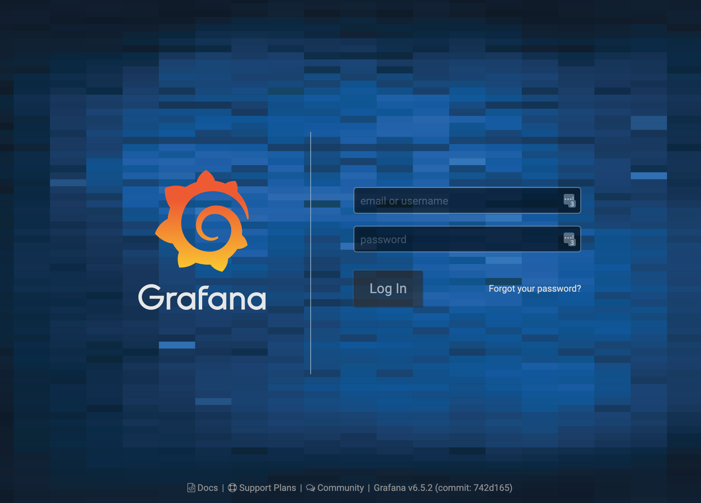
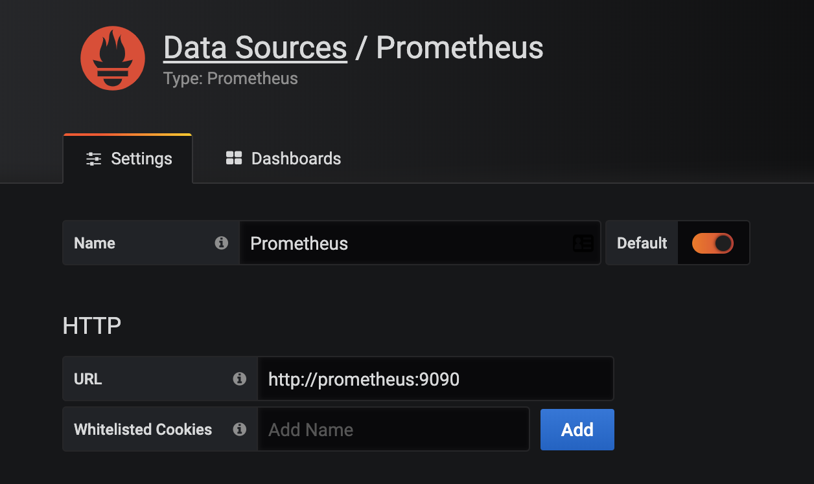

## Grafana

> 前面我们使用 Prometheus 采集了 Kubernetes 集群中的一些监控数据指标，我们也尝试使用 promQL 语句查询出了一些数据，并且在 Prometheus 的 Dashboard 中进行了展示，但是明显可以感觉到 Prometheus 的图表功能相对较弱，所以一般情况下我们会一个第三方的工具来展示这些数据，今天我们要和大家使用到的就是 Grafana。

> Grafana 是一个可视化面板，有着非常漂亮的图表和布局展示，功能齐全的度量仪表盘和图形编辑器，支持 Graphite、zabbix、InfluxDB、Prometheus、OpenTSDB、Elasticsearch 等作为数据源，比 Prometheus 自带的图表展示功能强大太多，更加灵活，有丰富的插件，功能更加强大。

### 安装

> 同样的我们将 grafana 安装到 Kubernetes 集群中，第一步去查看 grafana 的 docker 镜像的介绍，我们可以在 dockerhub 上去搜索，也可以在官网去查看相关资料，镜像地址如下：https://hub.docker.com/r/grafana/grafana/，我们可以看到介绍中运行 grafana 容器的命令非常简单：

```
$ docker run -d --name=grafana -p 3000:3000 grafana/grafana
```

> 但是还有一个需要注意的是 Changelog 中v5.1.0版本的更新介绍：

```
Major restructuring of the container
Usage of chown removed
File permissions incompatibility with previous versions
user id changed from 104 to 472
group id changed from 107 to 472
Runs as the grafana user by default (instead of root)
All default volumes removed
```

> 特别需要注意第3条，userid 和 groupid 都有所变化，所以我们在运行的容器的时候需要注意这个变化。现在我们将这个容器转化成 Kubernetes 中的 Pod：(grafana.yaml)

```
apiVersion: apps/v1
kind: Deployment
metadata:
  name: grafana
  namespace: kube-mon
spec:
  selector:
    matchLabels:
      app: grafana
  template:
    metadata:
      labels:
        app: grafana
    spec:
      volumes:
      - name: storage
        hostPath:
          path: /data/grafana/
      nodeSelector:
        monitor: prometheus
      securityContext:
        runAsUser: 0
      containers:
      - name: grafana
        image: grafana/grafana:1
        imagePullPolicy: IfNotPresent
        ports:
        - containerPort: 3000
          name: grafana
        env:
        - name: GF_SECURITY_ADMIN_USER
          value: admin
        - name: GF_SECURITY_ADMIN_PASSWORD
          value: admin321
        readinessProbe:
          failureThreshold: 10
          httpGet:
            path: /api/health
            port: 3000
            scheme: HTTP
          initialDelaySeconds: 60
          periodSeconds: 10
          successThreshold: 1
          timeoutSeconds: 30
        livenessProbe:
          failureThreshold: 3
          httpGet:
            path: /api/health
            port: 3000
            scheme: HTTP
          periodSeconds: 10
          successThreshold: 1
          timeoutSeconds: 1
        resources:
          limits:
            cpu: 150m
            memory: 512Mi
          requests:
            cpu: 150m
            memory: 512Mi
        volumeMounts:
        - mountPath: /var/lib/grafana
          name: storage
---
apiVersion: v1
kind: Service
metadata:
  name: grafana
  namespace: kube-mon
spec:
  type: NodePort
  ports:
    - port: 3000
  selector:
    app: grafana
```

> 我们使用了最新的镜像 

```
grafana/grafana:2
```

，然后添加了健康检查、资源声明，另外两个比较重要的环境变量

```
GF_SECURITY_ADMIN_USER
```

 和 

```
GF_SECURITY_ADMIN_PASSWORD
```

，用来配置 grafana 的管理员用户和密码的，由于 grafana 将 dashboard、插件这些数据保存在 `/var/lib/grafana` 这个目录下面的，所以我们这里如果需要做数据持久化的话，就需要针对这个目录进行 volume 挂载声明，和 Prometheus 一样，我们将 grafana 固定在一个具有 `monitor: prometheus` 标签的节点，由于上面我们刚刚提到的 Changelog 中 grafana 的 userid 和 groupid 有所变化，所以我们这里增加一个 `securityContext` 的声明来进行声明使用 root 用户运行。最后，我们需要对外暴露 grafana 这个服务，所以我们需要一个对应的 Service 对象，当然用 NodePort 或者再建立一个 ingress 对象都是可行的。

> 现在我们直接创建上面的这些资源对象：

```
$ kubectl apply -f grafana.yaml
deployment.apps "grafana" created
service "grafana" created
```

> 创建完成后，我们可以查看 grafana 对应的 Pod 是否正常：

```
$ kubectl get pods -n kube-mon -l app=grafana         
NAME                       READY   STATUS    RESTARTS   AGE
grafana-5579769f64-vfn7q   1/1     Running   0          77s
$ kubectl logs -f grafana-5579769f64-vfn7q -n kube-mon
......
logger=settings var="GF_SECURITY_ADMIN_USER=admin"
t=2019-12-13T06:35:08+0000 lvl=info msg="Config overridden from Environment variable"
......
t=2019-12-13T06:35:08+0000 lvl=info msg="Initializing Stream Manager"
t=2019-12-13T06:35:08+0000 lvl=info msg="HTTP Server Listen" logger=http.server address=[::]:3000 protocol=http subUrl= socket=
```

> 看到上面的日志信息就证明我们的 grafana 的 Pod 已经正常启动起来了。这个时候我们可以查看 Service 对象：

```
$ kubectl get svc -n kube-mon
NAME         TYPE        CLUSTER-IP      EXTERNAL-IP   PORT(S)             AGE
grafana      NodePort    1158   <none>        3000:31548/TCP      12m
......
```

> 现在我们就可以在浏览器中使用 

```
http://<任意节点IP:31548>
```

 来访问 grafana 这个服务了：

> 

> 由于上面我们配置了管理员的，所以第一次打开的时候会跳转到登录界面，然后就可以用上面我们配置的两个环境变量的值来进行登录了，登录完成后就可以进入到下面 Grafana 的首页，然后点击`Add data source`进入添加数据源界面。

> 我们这个地方配置的数据源是 `Prometheus`，我们这里 Prometheus 和 Grafana 都处于 kube-mon 这同一个 namespace 下面，所以我们这里的数据源地址：

```
http://prometheus:9090
```

（因为在同一个 namespace 下面所以直接用 Service 名也可以），然后其他的配置信息就根据实际情况了，比如 Auth 认证，我们这里没有，所以跳过即可，点击最下方的 `Save & Test` 提示成功证明我们的数据源配置正确：

> 

### 插件

> 我们也可以安装一些其他插件，比如 grafana 就有一个专门针对 Kubernetes 集群监控的插件：grafana-kubernetes-app，但是该插件很久没有更新了，这里我们介绍一个功能更加强大的插件 DevOpsProdigy KubeGraf，它是 Grafana 官方的 Kubernetes 插件 的升级版本，该插件可以用来可视化和分析 Kubernetes 集群的性能，通过各种图形直观的展示了 Kubernetes 集群的主要服务的指标和特征，还可以用于检查应用程序的生命周期和错误日志。

> 要安装这个插件，需要到 grafana 的 Pod 里面去执行安装命令：

```
$ kubectl exec -it grafana-5579769f64-7729f -n kube-mon /bin/bash
bash-0# grafana-cli plugins install devopsprodigy-kubegraf-app

installing devopsprodigy-kubegraf-app @ 0
from: https://grafana.com/api/plugins/devopsprodigy-kubegraf-app/versions/0/download
into: /var/lib/grafana/plugins

✔ Installed devopsprodigy-kubegraf-app successfully 

Restart grafana after installing plugins . <service grafana-server restart>
# 由于该插件依赖另外一个 Grafana-piechart-panel 插件，所以如果没有安装，同样需要先安装该插件。
bash-0# grafana-cli plugins install Grafana-piechart-panel
......
```

> 安装完成后需要重启 grafana 才会生效，我们这里直接删除 Pod，重建即可。Pod 删除重建完成后插件就安装成功了。然后通过浏览器打开 Grafana 找到该插件，点击 `enable` 启用插件。

> 

> 点击 

```
Set up your first k8s-cluster
```

 创建一个新的 Kubernetes 集群:

*   URL 使用 Kubernetes Service 地址即可：https://kubernetes.default:443
*   Access 访问模式使用：`Server(default)`
*   由于插件访问 Kubernetes 集群的各种资源对象信息，所以我们需要配置访问权限，这里我们可以简单使用 kubectl 的 `kubeconfig` 来进行配置即可。
*   勾选 Auth 下面的 `TLS Client Auth` 和 `With CA Cert` 两个选项
*   其中 `TLS Auth Details` 下面的值就对应 `kubeconfig` 里面的证书信息。比如我们这里的 `kubeconfig` 文件格式如下所示：

```
apiVersion: v1
clusters:
- cluster:
    certificate-authority-data: <certificate-authority-data>
    server: https://ydzs-master:6443
  name: kubernetes
contexts:
- context:
    cluster: kubernetes
    user: kubernetes-admin
  name: kubernetes-admin@kubernetes
current-context: 'kubernetes-admin@kubernetes'
kind: Config
preferences: {}
users:
- name: kubernetes-admin
  user:
    client-certificate-data: <client-certificate-data>
    client-key-data: <client-key-data>
```

> 那么 `CA Cert` 的值就对应 `kubeconfig` 里面的 

```
<certificate-authority-data>
```

 进行 base64 解码过后的值；`Client Cert` 的值对应 

```
<client-certificate-data>
```

 进行 base64 解码过后的值；`Client Key` 的值就对应 `<client-key-data>` 进行 base64 解码过后的值。

> base64 解码

> 对于 base64 解码推荐使用一些在线的服务，比如 https://www.base64decode.org/，非常方便。

*   最后在 

    ```
    additional datasources
    ```

     下拉列表中选择 prometheus 的数据源。
*   点击 `Save & Test` 正常就可以保存成功了。

> 插件配置完成后，在左侧侧边栏就会出现 

```
DevOpsProdigy KubeGraf
```

 插件的入口，通过插件页面可以查看整个集群的状态。

> 

> 还有几个漂亮的 Dashboard 可以供我们来进行监控图表的展示：

> 

### 导入 Dashboard

> 为了能够快速对系统进行监控，我们可以直接复用别人的 Grafana Dashboard，在 Grafana 的官方网站上就有很多非常优秀的第三方 Dashboard，我们完全可以直接导入进来即可。比如我们想要对所有的集群节点进行监控，也就是 node-exporter 采集的数据进行展示，这里我们就可以导入 https://grafana.com/grafana/dashboards/8919 这个 Dashboard。

> 在侧边栏点击 "+"，选择 `Import`，在 Grafana Dashboard 的文本框中输入 8919 即可导入：

> 

> 进入导入 Dashboard 的页面，可以编辑名称，选择 Prometheus 的数据源：

> 

> 保存后即可进入导入的 Dashboard 页面。由于该 Dashboard 更新比较及时，所以基本上导入进来就可以直接使用了，我们也可以对页面进行一些调整，如果有的图表没有出现对应的图形，则可以编辑根据查询语句去 DEBUG。

> 

### 自定义图表

> 导入现成的第三方 Dashboard 或许能解决我们大部分问题，但是毕竟还会有需要定制图表的时候，这个时候就需要了解如何去自定义图表了。

> 同样在侧边栏点击 "+"，选择 Dashboard，然后选择 `Choose Visualization` 创建一个可视化的图表：

> 

> 可以根据需要选择各种类型的图表，比如我们这里选择一个 `Graph` 类型的：

> 

> 然后选择左侧图标中的第一个 `Queries` tab，然后选择 `Prometheus` 这个数据源：

> 

> 然后在 `Metrics` 区域输入我们要查询的监控 PromQL 语句，比如我们这里想要查询集群节点 CPU 的使用率：

```
(1 - sum(increase(node_cpu_seconds_total{mode="idle", instance=~"$node"}[1m])) by (instance) / sum(increase(node_cpu_seconds_total{instance=~"$node"}[1m])) by (instance)) * 100
```

> 虽然我们现在还没有具体的学习过 PromQL 语句，但其实我们仔细分析上面的语句也不是很困难，集群节点的 CPU 使用率实际上就相当于排除空闲 CPU 的使用率，所以我们可以优先计算空闲 CPU 的使用时长，除以总的 CPU 时长就是使用率了，用 1 减掉过后就是 CPU 的使用率了，如果想用百分比来表示的话则乘以 100 即可。

> 这里有一个需要注意的地方是在 PromQL 语句中有一个 `install=~"$node"` 的标签，其实意思就是根据 `$node` 这个参数来进行过滤，也就是我们希望在 Grafana 里面通过参数化来控制每一次计算哪一个节点的 CPU 使用率。

> 所以这里就涉及到 Grafana 里面的参数使用。点击页面顶部的 `Dashboard Settings` 按钮进入配置页面：

> 

> 在左侧 tab 栏点击 `Variables` 进入参数配置页面，如果还没有任何参数，可以通过点击 `Add Variable` 添加一个新的变量：

> 

> 这里需要注意的是变量的名称 `node` 就是上面我们在 PromQL 语句里面使用的 `$node` 这个参数，这两个地方必须保持一致，然后最重要的就是参数的获取方式了，比如我们可以通过 `Prometheus` 这个数据源，通过 `kubelet_node_name` 这个指标来获取，在 Prometheus 里面我们可以查询该指标获取到的值为：

> 

> 我们其实只是想要获取节点的名称，所以我们可以用正则表达式去匹配 `node=xxx` 这个标签，将匹配的值作为参数的值即可:

> 

> 在最下面的 `Preview of values` 里面会有获取的参数值的预览结果。除此之外，我们还可以使用一个更方便的 `labe_values` 函数来获取，该函数可以用来直接获取某个指标的 label 值：

> 

> 另外由于我们希望能够让用户自由选择一次性可以查询多少个节点的数据，所以我们将 `Multi-value` 以及 `Include All option` 都勾选上了，最后记得保存，保存后跳转到 Dashboard 页面就可以看到我们自定义的图表信息：

> 

> 而且还可以根据参数选择一个或者多个节点，当然图表的标题和大小都可以自由去更改：

> 