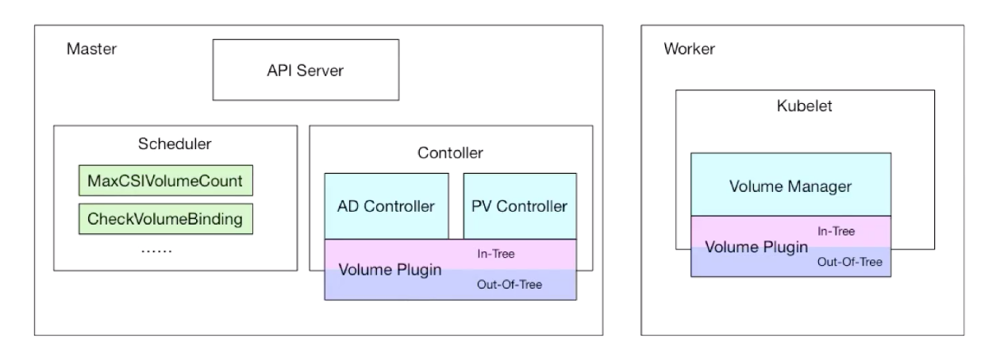
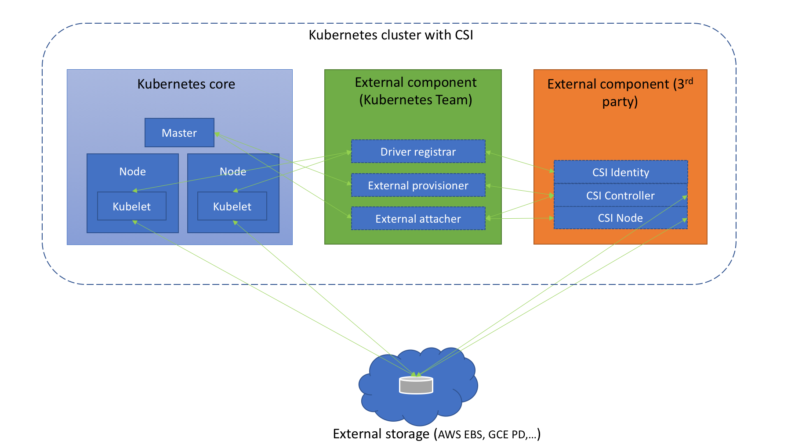
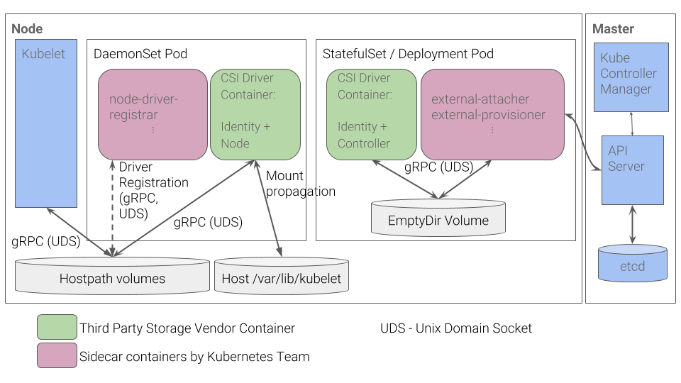


## 存储原理¶

> 前面的章节中我们介绍了在 Kubernetes 中的持久化存储的使用，了解了 PV、PVC 以及 StorageClass 的使用方法，从本地存储到 Ceph 共享存储都有学习，到这里我们其实已经可以完成应用各种场景的数据持久化了，但是难免在实际的使用过程中会遇到各种各样的问题，要解决这些问题最好的方式就是来了解下 Kubernetes 中存储的实现原理。

> Kubernetes 默认情况下就提供了主流的存储卷接入方案，我们可以执行命令 

```
kubectl explain pod.spec.volumes
```

 查看到支持的各种存储卷，另外也提供了插件机制，允许其他类型的存储服务接入到 Kubernetes 系统中来，在 Kubernetes 中就对应 `In-Tree` 和 `Out-Of-Tree` 两种方式，`In-Tree` 就是在 Kubernetes 源码内部实现的，和 Kubernetes 一起发布、管理的，但是更新迭代慢、灵活性比较差，`Out-Of-Tree` 是独立于 Kubernetes 的，目前主要有 `CSI` 和 `FlexVolume` 两种机制，开发者可以根据自己的存储类型实现不同的存储插件接入到 Kubernetes 中去，其中 `CSI` 是现在也是以后主流的方式，所以当然我们的重点也会是 `CSI` 的使用介绍。

### 存储架构¶

> 前面我们了解到了 PV、PVC、StorgeClass 的使用，但是他们是如何和我们的 Pod 关联起来使用的呢？这就需要从 Volume 的处理流程和原理说起了。

> 如下所示，我们创建了一个 nfs 类型的 PV 资源对象：（volume.yaml）

```
apiVersion: v1
kind: PersistentVolume
metadata:
  name: nfs-pv
spec:
  storageClassName: manual
  capacity: 
    storage: 1Gi
  accessModes:
  - ReadWriteOnce
  persistentVolumeReclaimPolicy: Retain
  nfs:
    path: /data/k8s  # 指定nfs的挂载点
    server: 111  # 指定nfs服务地址
---
apiVersion: v1
kind: PersistentVolumeClaim
metadata:
  name: nfs-pvc
spec:
  storageClassName: manual
  accessModes:
  - ReadWriteOnce
  resources:
    requests:
      storage: 1Gi
```

> 我们知道用户真正使用的是 PVC，而要使用 PVC 的前提就是必须要先和某个符合条件的 PV 进行一一绑定，比如存储容器、访问模式，以及 PV 和 PVC 的 storageClassName 字段必须一样，这样才能够进行绑定，当 PVC 和 PV 绑定成功后就可以直接使用这个 PVC 对象了：(pod.yaml)

```
apiVersion: v1
kind: Pod
metadata:
  name: test-volumes
spec:
  volumes:
  - name: nfs
    persistentVolumeClaim:
      claimName: nfs-pvc
  containers:
  - name: web
    image: nginx
    ports:
    - name: web
      containerPort: 80
    volumeMounts:
    - name: nfs
      subPath: test-volumes
      mountPath: "/usr/share/nginx/html"
```

> 直接创建上面的资源对象即可：

```
$ kubectl apply -f volume.yaml
$ kubectl apply -f pod.yaml
```

> 我们只是在 volumes 中指定了我们上面创建的 PVC 对象，当这个 Pod 被创建之后， kubelet 就会把这个 PVC 对应的这个 NFS 类型的 Volume（PV）挂载到这个 Pod 容器中的目录中去。前面我们也提到了这样的话对于普通用户来说完全就不用关心后面的具体存储在 NFS 还是 Ceph 或者其他了，只需要直接使用 PVC 就可以了，因为真正的存储是需要很多相关的专业知识的，这样就完全职责分离解耦了。

> 普通用户直接使用 PVC 没有问题，但是也会出现一个问题，那就是当普通用户创建一个 PVC 对象的时候，这个时候系统里面并没有合适的 PV 来和它进行绑定，因为 PV 大多数情况下是管理员给我们创建的，这个时候启动 Pod 肯定就会失败了，如果现在管理员如果去创建一个对应的 PV 的话，PVC 和 PV 当然就可以绑定了，然后 Pod 也会自动的启动成功，这是因为在 Kubernetes 中有一个专门处理持久化存储的控制器 Volume Controller，这个控制器下面有很多个控制循环，其中一个就是用于 PV 和 PVC 绑定的 PersistentVolumeController。

> PersistentVolumeController 会不断地循环去查看每一个 PVC，是不是已经处于 Bound（已绑定）状态。如果不是，那它就会遍历所有的、可用的 PV，并尝试将其与未绑定的 PVC 进行绑定，这样，Kubernetes 就可以保证用户提交的每一个 PVC，只要有合适的 PV 出现，它就能够很快进入绑定状态。而所谓将一个 PV 与 PVC 进行`绑定`，其实就是将这个 PV 对象的名字，填在了 PVC 对象的 `spec.volumeName` 字段上。

> PV 和 PVC 绑定上了，那么又是如何将容器里面的数据进行持久化的呢，前面我们学习过 Docker 的 Volume 挂载，其实就是`将一个宿主机上的目录和一个容器里的目录绑定挂载在了一起`，具有持久化功能当然就是指的宿主机上面的这个目录了，当容器被删除或者在其他节点上重建出来以后，这个目录里面的内容依然存在，所以一般情况下实现持久化是需要一个远程存储的，比如 NFS、Ceph 或者云厂商提供的磁盘等等。所以接下来需要做的就是持久化宿主机目录这个过程。

> 当 Pod 被调度到一个节点上后，节点上的 kubelet 组件就会为这个 Pod 创建它的 Volume 目录，默认情况下 kubelet 为 Volume 创建的目录在 kubelet 工作目录下面：

```
/var/lib/kubelet/pods/<Pod的ID>/volumes/kubernetes.io~<Volume类型>/<Volume名字>
```

> 比如上面我们创建的 Pod 对应的 Volume 目录完整路径为：

```
/var/lib/kubelet/pods/d4fcdb11-baf7-43d9-8d7d-3ede24118e08/volumes/kubernetes.io~nfs/nfs-pv
```

> 提示

> 要获取 Pod 的唯一标识 uid，可通过命令 

```
kubectl get pod pod名 -o jsonpath={.metadata.uid}
```

 获取。

> 然后就需要根据我们的 Volume 类型来决定需要做什么操作了，比如上节课我们用的 Ceph RBD，那么 kubelet 就需要先将 Ceph 提供的 RBD 挂载到 Pod 所在的宿主机上面，这个阶段在 Kubernetes 中被称为 Attach 阶段。Attach 阶段完成后，为了能够使用这个块设备，kubelet 还要进行第二个操作，即：格式化这个块设备，然后将它挂载到宿主机指定的挂载点上。这个挂载点，也就是上面我们提到的 Volume 的宿主机的目录。将块设备格式化并挂载到 Volume 宿主机目录的操作，在 Kubernetes 中被称为 Mount 阶段。上节课我们使用 Ceph RBD 持久化的 Wordpress 的 MySQL 数据，我们可以查看对应的 Volume 信息：

```
$ kubectl get pods -o wide -l app=wordpress
NAME                              READY   STATUS    RESTARTS   AGE   IP             NODE         NOMINATED NODE   READINESS GATES
wordpress-5b886cf59b-dv2zt        1/1     Running   0          20d   2158   ydzs-node1   <none>           <none>
wordpress-mysql-b9ddd6d4c-pjhbt   1/1     Running   0          20d   270    ydzs-node4   <none>           <none>
```

> 我们可以看到 MySQL 运行在 node4 节点上，然后可以在该节点上查看 Volume 信息，Pod 对应的 uid 可以通过如下命令获取：

```
$ kubectl get pod wordpress-mysql-b9ddd6d4c-pjhbt -o jsonpath={.metadata.uid}
3f84af87-9f58-4c69-9e38-5ef234498133
$ ls /var/lib/kubelet/pods/3f84af87-9f58-4c69-9e38-5ef234498133/volumes/kubernetes.io~csi/pvc-c8861c23-c03d-47aa-96f6-73c4d4093109/
mount  vol_data.json
```

> 然后通过如下命令可以查看 Volume 的持久化信息：

```
$ findmnt /var/lib/kubelet/pods/3f84af87-9f58-4c69-9e38-5ef234498133/volumes/kubernetes.io~csi/pvc-c8861c23-c03d-47aa-96f6-73c4d4093109/mount
TARGET                                                                                            SOURCE    FSTYPE OPTIONS
/var/lib/kubelet/pods/3f84af87-9f58-4c69-9e38-5ef234498133/volumes/kubernetes.io~csi/pvc-c8861c23-c03d-47aa-96f6-73c4d4093109/mount    /dev/rbd0 ext4   rw,relatime,
```

> 可以看到这里的 Volume 是挂载到 `/dev/rbd0` 这个设备上面的，通过 `df` 命令也是可以看到的：

```
$ df -h |grep dev
devtmpfs        9G     0  9G   0% /dev
tmpfs           9G     0  9G   0% /dev/shm
/dev/vda3        18G  7G   13G  27% /
/dev/vda1       497M  158M  340M  32% /boot
/dev/vdb1       197G   24G  164G  13% /data
/dev/rbd0        20G  160M   20G   1% /var/lib/kubelet/pods/3f84af87-9f58-4c69-9e38-5ef234498133/volumes/kubernetes.io~csi/pvc-c8861c23-c03d-47aa-96f6-73c4d4093109/mount
```

> 这里我们就经过了 `Attach` 和 `Mount` 两个阶段完成了 Volume 的持久化。但是对于上面我们使用的 NFS 就更加简单了， 因为 NFS 存储并没有一个设备需要挂载到宿主机上面，所以这个时候 kubelet 就会直接进入第二个 `Mount` 阶段，相当于直接在宿主机上面执行如下的命令：

```
$ mount -t nfs 111:/data/k8s /var/lib/kubelet/pods/d4fcdb11-baf7-43d9-8d7d-3ede24118e08/volumes/kubernetes.io~nfs/nfs-pv
```

> 同样可以在测试的 Pod 所在节点查看 Volume 的挂载信息：

```
$ findmnt /var/lib/kubelet/pods/d4fcdb11-baf7-43d9-8d7d-3ede24118e08/volumes/kubernetes.io~nfs/nfs-pv
TARGET                                                                               SOURCE                 FSTYPE OPTIONS
/var/lib/kubelet/pods/d4fcdb11-baf7-43d9-8d7d-3ede24118e08/volumes/kubernetes.io~nfs/nfs-pv
                                                                                     111:/data/k8s nfs4   rw,relatime,
```

> 我们可以看到这个 Volume 被挂载到了 NFS（10.151.30.11:/data/k8s）下面，以后我们在这个目录里写入的所有文件，都会被保存在远程 NFS 服务器上。

> 这样在经过了上面的两个阶段过后，我们就得到了一个持久化的宿主机上面的 Volume 目录了，接下来 kubelet 只需要把这个 Volume 目录挂载到容器中对应的目录即可，这样就可以为 Pod 里的容器挂载这个持久化的 Volume 了，这一步其实也就相当于执行了如下所示的命令：

```
$ docker run -v /var/lib/kubelet/pods/<Pod的ID>/volumes/kubernetes.io~<Volume类型>/<Volume名字>:/<容器内的目标目录> 我的镜像 ...
```

> 整个存储的架构可以用下图来说明： 

*   PV Controller：负责 PV/PVC 的绑定，并根据需求进行数据卷的 Provision/Delete 操作
*   AD Controller：负责存储设备的 Attach/Detach 操作，将设备挂载到目标节点
*   Volume Manager：管理卷的 Mount/Unmount 操作、卷设备的格式化等操作
*   Volume Plugin：扩展各种存储类型的卷管理能力，实现第三方存储的各种操作能力和 Kubernetes 存储系统结合

> 我们上面使用的 NFS 就属于 In-Tree 这种方式，而上节课使用的 Ceph RBD 就是 Out-Of-Tree 的方式，而且是使用的是 CSI 插件。下面我们再来了解下 `FlexVolume` 和 `CSI` 两种插件方式。

### FlexVolume¶

> FlexVolume 提供了一种扩展 Kubernetes 存储插件的方式，用户可以自定义自己的存储插件。要使用 FlexVolume 需要在每个节点上安装存储插件二进制文件，该二进制需要实现 FlexVolume 的相关接口，默认存储插件的存放路径为

```
/usr/libexec/kubernetes/kubelet-plugins/volume/exec/<vendor~driver>/<driver>
```

，`VolumePlugins` 组件会不断 watch 这个目录来实现插件的添加、删除等功能。

> 其中 `vendor~driver` 的名字需要和 Pod 中`flexVolume.driver` 的字段名字匹配，例如：

```
/usr/libexec/kubernetes/kubelet-plugins/volume/exec/foo~cifs/cifs
```

> 对应的 Pod 中的 `flexVolume.driver` 属性为：`foo/cifs`。

> 在我们实现自定义存储插件的时候，需要实现 FlexVolume 的部分接口，因为要看实际需求，并不一定所有接口都需要实现。比如对于类似于 NFS 这样的存储就没必要实现 `attach/detach` 这些接口了，因为不需要，只需要实现 `init/mount/umount` 3个接口即可。

*   init: 

    ```
    <driver executable> init
    ```

     - kubelet/kube-controller-manager 初始化存储插件时调用，插件需要返回是否需要要 attach 和 detach 操作
*   attach: 

    ```
    <driver executable> attach <json options> <node name>
    ```

     - 将存储卷挂载到 Node 节点上
*   detach: 

    ```
    <driver executable> detach <mount device> <node name>
    ```

     - 将存储卷从 Node 上卸载
*   waitforattach: 

    ```
    <driver executable> waitforattach <mount device> <json options>
    ```

     - 等待 attach 操作成功（超时时间为 10 分钟）
*   isattached: 

    ```
    <driver executable> isattached <json options> <node name>
    ```

     - 检查存储卷是否已经挂载
*   mountdevice: 

    ```
    <driver executable> mountdevice <mount dir> <mount device> <json options>
    ```

     - 将设备挂载到指定目录中以便后续 bind mount 使用
*   unmountdevice: 

    ```
    <driver executable> unmountdevice <mount device>
    ```

     - 将设备取消挂载
*   mount: 

    ```
    <driver executable> mount <mount dir> <json options>
    ```

     - 将存储卷挂载到指定目录中
*   unmount: 

    ```
    <driver executable> unmount <mount dir>
    ```

     - 将存储卷取消挂载

> 实现上面的这些接口需要返回如下所示的 JSON 格式的数据：

```
{
    "status": "<Success/Failure/Not supported>",
    "message": "<Reason for success/failure>",
    "device": "<Path to the device attached. This field is valid only for attach & waitforattach call-outs>"
    "volumeName": "<Cluster wide unique name of the volume. Valid only for getvolumename call-out>"
    "attached": <True/False (Return true if volume is attached on the node. Valid only for isattached call-out)>
    "capabilities": <Only included as part of the Init response>
    {
        "attach": <True/False (Return true if the driver implements attach and detach)>
    }
}
```

> 比如我们来实现一个 NFS 的 FlexVolume 插件，最简单的方式就是写一个脚本，然后实现 init、mount、unmount 3个命令即可，然后按照上面的 JSON 格式返回数据，最后把这个脚本放在节点的 FlexVolume 插件目录下面即可。

> 下面就是官方给出的一个 NFS 的 FlexVolume 插件示例，可以从 https://github.com/kubernetes/examples/blob/master/staging/volumes/flexvolume/nfs 获取脚本：

```
#!/bin/bash
# 注意:
#  - 在使用插件之前需要先安装 jq。
usage() {
    err "Invalid usage. Usage: "
    err "\\t$0 init"
    err "\\t$0 mount <mount dir> <json params>"
    err "\\t$0 unmount <mount dir>"
    exit 1
}

err() {
    echo -ne $* 1>&2
}

log() {
    echo -ne $* >&1
}

ismounted() {
    MOUNT=`findmnt -n ${MNTPATH} 2>/dev/null | cut -d' ' -f1`
    if [ "${MOUNT}" == "${MNTPATH}" ]; then
        echo "1"
    else
        echo "0"
    fi
}

domount() {
    MNTPATH=$1

    NFS_SERVER=$(echo $2 | jq -r '.server')
    SHARE=$(echo $2 | jq -r '.share')

    if [ $(ismounted) -eq 1 ] ; then
        log '{"status": "Success"}'
        exit 0
    fi

    mkdir -p ${MNTPATH} &> /dev/null

    mount -t nfs ${NFS_SERVER}:/${SHARE} ${MNTPATH} &> /dev/null
    if [ $? -ne 0 ]; then
        err "{ \\"status\\": \\"Failure\\", \\"message\\": \\"Failed to mount ${NFS_SERVER}:${SHARE} at ${MNTPATH}\\"}"
        exit 1
    fi
    log '{"status": "Success"}'
    exit 0
}

unmount() {
    MNTPATH=$1
    if [ $(ismounted) -eq 0 ] ; then
        log '{"status": "Success"}'
        exit 0
    fi

    umount ${MNTPATH} &> /dev/null
    if [ $? -ne 0 ]; then
        err "{ \\"status\\": \\"Failed\\", \\"message\\": \\"Failed to unmount volume at ${MNTPATH}\\"}"
        exit 1
    fi

    log '{"status": "Success"}'
    exit 0
}

op=$1

if ! command -v jq >/dev/null 2>&1; then
    err "{ \\"status\\": \\"Failure\\", \\"message\\": \\"'jq' binary not found. Please install jq package before using this driver\\"}"
    exit 1
fi

if [ "$op" = "init" ]; then
    log '{"status": "Success", "capabilities": {"attach": false}}'
    exit 0
fi

if [ $# -lt 2 ]; then
    usage
fi

shift

case "$op" in
    mount)
        domount $*
        ;;
    unmount)
        unmount $*
        ;;
    *)
        log '{"status": "Not supported"}'
        exit 0
esac

exit 1
```

> 将上面脚本命名成 nfs，放置到 node1 节点对应的插件下面： 

```
/usr/libexec/kubernetes/kubelet-plugins/volume/exec/ydzs~nfs/nfs
```

，并设置权限为 700：

```
$ chmod 700 /usr/libexec/kubernetes/kubelet-plugins/volume/exec/ydzs~nfs/nfs
# 安装 jq 工具
$ yum -y install https://dl.fedoraproject.org/pub/epel/epel-release-latest-noarch.rpm
$ yum install jq -y
```

> 这个时候我们部署一个应用到 node1 节点上，并用 `flexVolume` 来持久化容器中的数据（当然也可以通过定义 flexvolume 类型的 PV、PVC 来使用），如下所示：(test-flexvolume.yaml)

```
apiVersion: v1
kind: Pod
metadata:
  name: test-flexvolume
spec:
  nodeSelector:
    kubernetes.io/hostname: ydzs-node1
  volumes:
  - name: test
    flexVolume:
      driver: "ydzs/nfs"  # 定义插件类型，根据这个参数在对应的目录下面找到插件的可执行文件
      fsType: "nfs"  # 定义存储卷文件系统类型
      options:  # 定义所有与存储相关的一些具体参数
        server: "111"
        share: "data/k8s"
  containers:
  - name: web
    image: nginx
    ports:
    - containerPort: 80
    volumeMounts:
    - name: test
      subPath: testflexvolume
      mountPath: /usr/share/nginx/html
```

> 其中 `flexVolume.driver` 就是插件目录 `ydzs~nfs` 对应的 `ydzs/nfs` 名称，`flexVolume.options` 中根据上面的 nfs 脚本可以得知里面配置的是 NFS 的 Server 地址和挂载目录路径，直接创建上面的资源对象：

```
$ kubectl apply -f test-flexvolume.yaml
$ kubectl get pods 
NAME                                      READY   STATUS    RESTARTS   AGE
test-flexvolume                           1/1     Running   0          13h
......
$ kubectl exec -it test-flexvolume mount |grep test
111:/data/k8s/testflexvolume on /usr/share/nginx/html type nfs4 (rw,relatime,vers=1,rsize=524288,wsize=524288,namlen=255,hard,proto=tcp,timeo=600,retrans=2,sec=sys,clientaddr=122,local_lock=none,addr=111)
$ mount |grep test
111:/data/k8s on /var/lib/kubelet/pods/a376832a-7638-4faf-b1a0-404956e8e60a/volumes/ydzs~nfs/test type nfs4 (rw,relatime,vers=1,rsize=524288,wsize=524288,namlen=255,hard,proto=tcp,timeo=600,retrans=2,sec=sys,clientaddr=122,local_lock=none,addr=111)
111:/data/k8s/testflexvolume on /var/lib/kubelet/pods/a376832a-7638-4faf-b1a0-404956e8e60a/volume-subpaths/test/web/0 type nfs4 (rw,relatime,vers=1,rsize=524288,wsize=524288,namlen=255,hard,proto=tcp,timeo=600,retrans=2,sec=sys,clientaddr=122,local_lock=none,addr=111)
```

> 同样我们可以查看到 Pod 的本地持久化目录是被 mount 到了 NFS 上面，证明上面我们的 FlexVolume 插件是正常的。

> 调用

> 当我们要去真正的 mount NFS 的时候，就是通过 kubelet 调用 VolumePlugin，然后直接执行命令

```
/usr/libexec/kubernetes/kubelet-plugins/volume/exec/ydzs~nfs/nfs mount <mount dir> <json param>
```

 来完成的，就相当于平时我们在宿主机上面手动挂载 NFS 的方式一样的，所以存储插件 nfs 是一个可执行的二进制文件或者 shell 脚本都是可以的。

### CSI¶

> 既然已经有了 FlexVolume 插件了，为什么还需要 CSI 插件呢？上面我们使用 FlexVolume 插件的时候可以看出 FlexVolume 插件实际上相当于就是一个普通的 shell 命令，类似于平时我们在 Linux 下面执行的 `ls` 命令一样，只是返回的信息是 JSON 格式的数据，并不是我们通常认为的一个常驻内存的进程，而 CSI 是一个更加完善、编码更加方便友好的一种存储插件扩展方式。

> CSI 是由来自 Kubernetes、Mesos、 Cloud Foundry 等社区成员联合制定的一个行业标准接口规范，旨在将任意存储系统暴露给容器化应用程序。CSI 规范定义了存储提供商实现 CSI 兼容插件的最小操作集合和部署建议，CSI 规范的主要焦点是声明插件必须实现的接口。

> 在 Kubernetes 上整合 CSI 插件的整体架构如下图所示： 

> Kubernetes CSI 存储体系主要由两部分组成：

*   > Kubernetes 外部组件：包含 Driver registrar、External provisioner、External attacher 三部分，这三个组件是从 Kubernetes 原本的 in-tree 存储体系中剥离出来的存储管理功能，实际上是 Kubernetes 中的一种外部 controller ，它们 watch kubernetes 的 API 资源对象，根据 watch 到的状态来调用下面提到的第二部分的 CSI 插件来实现存储的管理和操作。这部分是 Kubernetes 团队维护的，插件开发者完全不必关心其实现细节。

    *   Driver registra：用于将插件注册到 kubelet 的 sidecar 容器，并将驱动程序自定义的 NodeId 添加到节点的 Annotations 上，通过与 CSI 上面的 Identity 服务进行通信调用 CSI 的 GetNodeId 方法来完成该操作。
    *   External provisioner：用于 watch Kubernetes 的 PVC 对象并调用 CSI 的 CreateVolume 和 DeleteVolume 操作。
    *   External attacher：用于 Attach/Detach 阶段，通过 watch Kubernetes 的 VolumeAttachment 对象并调用 CSI 的 ControllerPublish 和 ControllerUnpublish 操作来完成对应的 Volume 的 Attach/Detach。而 Volume 的 Mount/Unmount 阶段并不属于外部组件，当真正需要执行 Mount 操作的时候，kubelet 会去直接调用下面的 CSI Node 服务来完成 Volume 的 Mount/UnMount 操作。
*   > CSI 存储插件: 这部分正是开发者需要实现的 CSI 插件部分，都是通过 gRPC 实现的服务，一般会用一个二进制文件对外提供服务，主要包含三部分：CSI Identity、CSI Controller、CSI Node。

    *   CSI Identity — 主要用于负责对外暴露这个插件本身的信息，确保插件的健康状态。

        ```
        service Identity {
            // 返回插件的名称和版本
            rpc GetPluginInfo(GetPluginInfoRequest)
                returns (GetPluginInfoResponse) {}
            // 返回这个插件的包含的功能，比如非块存储类型的 CSI 插件不需要实现 Attach 功能，GetPluginCapabilities 就可以在返回中标注这个 CSI 插件不包含 Attach 功能
            rpc GetPluginCapabilities(GetPluginCapabilitiesRequest)
                returns (GetPluginCapabilitiesResponse) {}
            // 插件插件是否正在运行
            rpc Probe (ProbeRequest)
                returns (ProbeResponse) {}
        }
        ```

    *   CSI Controller - 主要实现 Volume 管理流程当中的 Provision 和 Attach 阶段，Provision 阶段是指创建和删除 Volume 的流程，而 Attach 阶段是指把存储卷附着在某个节点或脱离某个节点的流程，另外只有块存储类型的 CSI 插件才需要 Attach 功能。

        ```
        service Controller {
            // 创建存储卷，包括云端存储介质以及PV对象
            rpc CreateVolume (CreateVolumeRequest)
                returns (CreateVolumeResponse) {}

            //  删除存储卷
            rpc DeleteVolume (DeleteVolumeRequest)
                returns (DeleteVolumeResponse) {}

            // 挂载存储卷，将存储介质挂载到目标节点
            rpc ControllerPublishVolume (ControllerPublishVolumeRequest)
                returns (ControllerPublishVolumeResponse) {}

            // 卸载存储卷
            rpc ControllerUnpublishVolume (ControllerUnpublishVolumeRequest)
                returns (ControllerUnpublishVolumeResponse) {}

            // 例如：是否可以同时用于多个节点的读/写
            rpc ValidateVolumeCapabilities (ValidateVolumeCapabilitiesRequest)
                returns (ValidateVolumeCapabilitiesResponse) {}

            // 返回所有可用的 volumes
            rpc ListVolumes (ListVolumesRequest)
                returns (ListVolumesResponse) {}

            // 可用存储池的总容量
            rpc GetCapacity (GetCapacityRequest)
                returns (GetCapacityResponse) {}

            // 例如. 插件可能未实现 GetCapacity、Snapshotting
            rpc ControllerGetCapabilities (ControllerGetCapabilitiesRequest)
                returns (ControllerGetCapabilitiesResponse) {}

            // 创建快照
            rpc CreateSnapshot (CreateSnapshotRequest)
                returns (CreateSnapshotResponse) {}

            // 删除指定的快照
            rpc DeleteSnapshot (DeleteSnapshotRequest)
                returns (DeleteSnapshotResponse) {}

            // 获取所有的快照
            rpc ListSnapshots (ListSnapshotsRequest)
                returns (ListSnapshotsResponse) {}
        }
        ```

    *   CSI Node — 负责控制 Kubernetes 节点上的 Volume 操作。其中 Volume 的挂载被分成了 NodeStageVolume 和 NodePublishVolume 两个阶段。NodeStageVolume 接口主要是针对块存储类型的 CSI 插件而提供的，块设备在 "Attach" 阶段被附着在 Node 上后，需要挂载至 Pod 对应目录上，但因为块设备在 linux 上只能 mount 一次，而在 kubernetes volume 的使用场景中，一个 volume 可能被挂载进同一个 Node 上的多个 Pod 实例中，所以这里提供了 NodeStageVolume 这个接口，使用这个接口把块设备格式化后先挂载至 Node 上的一个临时全局目录，然后再调用 NodePublishVolume 使用 linux 中的 `bind mount` 技术把这个全局目录挂载进 Pod 中对应的目录上。

        ```
        service Node {
            // 在节点上初始化存储卷（格式化），并执行挂载到Global目录
            rpc NodeStageVolume (NodeStageVolumeRequest)
                returns (NodeStageVolumeResponse) {}

            // umount 存储卷在节点上的 Global 目录
            rpc NodeUnstageVolume (NodeUnstageVolumeRequest)
                returns (NodeUnstageVolumeResponse) {}

            // 在节点上将存储卷的 Global 目录挂载到 Pod 的实际挂载目录
            rpc NodePublishVolume (NodePublishVolumeRequest)
                returns (NodePublishVolumeResponse) {}

            // unmount 存储卷在节点上的 Pod 挂载目录
            rpc NodeUnpublishVolume (NodeUnpublishVolumeRequest)
                returns (NodeUnpublishVolumeResponse) {}

            // 获取节点上Volume挂载文件系统统计信息（总空间、可用空间等）
            rpc NodeGetVolumeStats (NodeGetVolumeStatsRequest)
                returns (NodeGetVolumeStatsResponse) {}

            // 获取节点的唯一 ID
            rpc NodeGetId (NodeGetIdRequest)
                returns (NodeGetIdResponse) {
                option deprecated = true;
            }

            // 返回节点插件的能力
            rpc NodeGetCapabilities (NodeGetCapabilitiesRequest)
                returns (NodeGetCapabilitiesResponse) {}

            // 获取节点的一些信息
            rpc NodeGetInfo (NodeGetInfoRequest)
                returns (NodeGetInfoResponse) {}
        }
        ```

> 只需要实现上面的接口就可以实现一个 CSI 插件了。虽然 Kubernetes 并未规定 CSI 插件的打包安装，但是提供了以下建议来简化我们在 Kubernetes 上容器化 CSI Volume 驱动程序的部署方案，具体的方案介绍可以查看 CSI 规范介绍文档 https://github.com/kubernetes/community

> 

> 按照上图的推荐方案，CSI Controller 部分以 StatefulSet 或者 Deployment 方式部署，CSI Node 部分以 DaemonSet 方式部署。因为这两部分实现在同一个 CSI 插件程序中，因此只需要把这个 CSI 插件与 External Components 以容器方式部署在同一个 Pod中，把这个 CSI 插件与 Driver registrar 以容器方式部署在 DaemonSet 的 Pod 中，即可完成 CSI 的部署。

> 前面我们使用的 Rook 部署的 Ceph 集群就是实现了 CSI 插件的:

```
$ kubectl get pods -n rook-ceph |grep plugin
csi-cephfsplugin-2s9d5                                 3/3     Running     0          21d
csi-cephfsplugin-fgp4v                                 3/3     Running     0          17d
csi-cephfsplugin-fv5nx                                 3/3     Running     0          21d
csi-cephfsplugin-mn8q4                                 3/3     Running     0          17d
csi-cephfsplugin-nf6h8                                 3/3     Running     0          21d
csi-cephfsplugin-provisioner-56c8b7ddf4-68h6d          4/4     Running     0          21d
csi-cephfsplugin-provisioner-56c8b7ddf4-rq4t6          4/4     Running     0          21d
csi-cephfsplugin-xwnl4                                 3/3     Running     0          21d
csi-rbdplugin-7r88w                                    3/3     Running     0          21d
csi-rbdplugin-95g5j                                    3/3     Running     0          21d
csi-rbdplugin-bnzpr                                    3/3     Running     0          21d
csi-rbdplugin-dvftb                                    3/3     Running     0          21d
csi-rbdplugin-jzmj2                                    3/3     Running     0          17d
csi-rbdplugin-provisioner-6ff4dd4b94-bvtss             5/5     Running     0          21d
csi-rbdplugin-provisioner-6ff4dd4b94-lfn68             5/5     Running     0          21d
csi-rbdplugin-trxb4                                    3/3     Running     0          17d
```

> 这里其实是实现了 RBD 和 CephFS 两种 CSI，用 DaemonSet 在每个节点上运行了一个包含 `Driver registra` 容器的 Pod，当然和节点相关的操作比如 Mount/Unmount 也是在这个 Pod 里面执行的，其他的比如 Provision、Attach 都是在另外的 

```
csi-rbdplugin-provisioner-xxx
```

 Pod 中执行的。